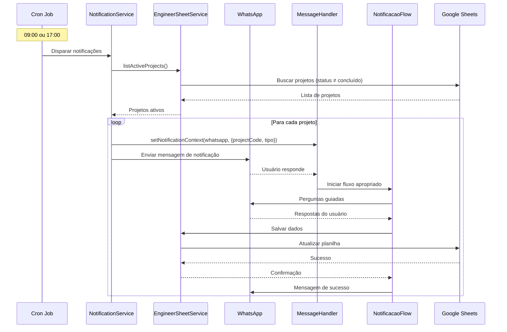

# 🔔 Sistema de Notificações Automáticas - Implementação Completa

## ✅ Status: IMPLEMENTADO

Todas as funcionalidades foram implementadas com sucesso!

---

## 📋 O QUE FOI IMPLEMENTADO

### 1. **Constantes e Mapeamentos Expandidos**

#### Tipos de Projeto (24 opções)
```
H1-H6: Projetos Hidrossanitários
E1-E4: Projetos Elétricos
T1-T4: Projetos de Telecom
G1-G4: Projetos de Gás
CL1-CL4: Projetos de Climatização
```

#### Áreas de Projeto (21 opções)
```
climatização, elétrica, hidrossanitário, telecom, gás, drenagem,
rede de água, furação e encamisamento, esgoto, cant de obra BT,
cant de obra BRT, cant de obra energisa, subestação, rede de esgoto,
rede de drenagem, rede elétrica subterrânea, rede elétrica aérea,
exaustão, solar fotovoltaico, hidráulico piscina, solução sanitária
```

#### Tipos de Obra (4 opções)
```
casa, prédio, comercial, misto
```

#### Status do Projeto (7 opções)
```
aguardando início, aguardando inf. cliente, em execução,
em aprovação, parado cliente, parado tecpred, concluído
```

#### Descrições Automáticas por Tipo
Cada tipo (H1-CL4) tem uma descrição completa pré-definida que é preenchida automaticamente.

Exemplo:
- H1 → "H - CASA PADRÃO: TÉRREO E PAV. SUPERIOR"
- E4 → "E - PRÉDIO (MODELO ALLIANCE ESSENCE): SUBSOLO-03, SUBSOLO-02..."

#### Percentuais por Etapa
```
Aguardando início → 0%
Recebimento da documentação → 5%
Serviços Preliminares → 20%
Primeira Fase → 35%
Detalhamento → 55%
Segunda Fase → 70%
Revisão interna → 75%
Enviado → 80%
Aprovado → 90%
Concluído → 100%
```

#### Menus Dinâmicos por Status

**Previsão para o dia** (varia conforme status):
- `aguardando início`: 6 opções
- `em execução`: 13 opções
- `em aprovação`: 5 opções
- `parado cliente`: 5 opções
- `parado tecpred`: 5 opções
- `concluído`: 4 opções

**Feito ao final do dia** (varia conforme status):
- `aguardando início`: 4 opções
- `em execução`: 9 opções
- `em aprovação`: 4 opções
- `parado cliente`: 4 opções
- `parado tecpred`: 3 opções
- `concluído`: 3 opções

---

### 2. **Fluxo de Cadastro Migrado**

#### Sequência Completa (Novo Projeto):

1. **Cliente** (texto livre, mínimo 3 caracteres)
2. **Contato** (texto livre, mínimo 5 caracteres)
3. **Obra** (menu 4 opções)
4. **Área** (menu 21 opções)
5. **Tipo** (menu 24 opções) → gera descrição automática
6. **Data Previsão Interna** (DD/MM/AAAA)
7. **Data Final Cliente** (DD/MM/AAAA)
8. **Confirmação**

#### Campos Automáticos Gerados:
- ✅ Código do Projeto (PRJ-001, PRJ-002...)
- ✅ Descrição do Projeto (conforme tipo)
- ✅ Data de Início (data do cadastro)
- ✅ Prazo Interno (dias úteis calculados)
- ✅ Prazo Cliente (dias úteis calculados)
- ✅ Dias de Atraso (inicial = 0)

---

### 3. **Fluxos de Notificações**

#### 🌅 Notificação Matinal (09:00)

**Arquivo:** `chatbot/flows/notificationFlows.ts`

**Campos Coletados:**
1. Status do Projeto (menu 7 opções)
2. Previsão para o Dia (menu dinâmico conforme status)

**Fluxo:**
```
inicio → status → previsao (menu dinâmico) → confirmacao → salvar
```

**Validações:**
- Status obrigatório
- Previsão obrigatória

**Salvamento:**
- Atualiza apenas 2 campos na planilha
- Método: `updateMorningData()`

---

#### 🌙 Notificação Noturna (17:00)

**Arquivo:** `chatbot/flows/notificationFlows.ts`

**Campos Coletados:**
1. Feito ao Final do Dia (menu dinâmico conforme status) - OBRIGATÓRIO
2. Necessitou de Retrabalho? (sim/não) - OBRIGATÓRIO
3. Motivo da Revisão (menu 6 opções) - CONDICIONAL (só se retrabalho = sim)
4. Etapa (menu 10 opções) - OBRIGATÓRIO
5. Observações (texto livre) - **OBRIGATÓRIO** (mínimo 5 caracteres)

**Campos Automáticos:**
- Data do Registro do Retrabalho (se retrabalho = sim)
- % Executado (conforme etapa escolhida)

**Fluxo:**
```
inicio → feito (menu dinâmico) → retrabalho → [motivo?] → etapa → observacoes (OBRIGATÓRIO) → confirmacao → salvar
```

**Validações Rígidas:**
```typescript
❌ Não permite finalizar sem:
- Feito ao final do dia
- Necessitou de retrabalho
- Etapa
- Observações (mínimo 5 caracteres)
```

**Salvamento:**
- Atualiza 4-6 campos na planilha
- Método: `updateNightData()`

---

### 4. **Serviço de Notificações**

**Arquivo:** `integrations/notifications/notificationService.ts`

**Classe:** `NotificationService`

**Métodos:**

1. **`sendMorningNotifications()`**
   - Busca todos os projetos ativos (status ≠ 'concluído')
   - Envia UMA MENSAGEM POR PROJETO
   - Formato: "🌅 Notificação Matinal - Projeto PRJ-XXX..."
   - Define contexto de notificação no MessageHandler

2. **`sendNightNotifications()`**
   - Busca todos os projetos ativos
   - Envia UMA MENSAGEM POR PROJETO
   - Formato: "🌙 Notificação Noturna - Projeto PRJ-XXX..."
   - Define contexto de notificação no MessageHandler

3. **`setWhatsAppClient(client)`**
   - Injeta cliente WhatsApp

4. **`setMessageHandler(handler)`**
   - Injeta MessageHandler para gerenciar contexto

---

### 5. **Cron Jobs**

**Arquivo:** `integrations/cron/cronJobs.ts`

**Classe:** `CronJobManager`

**Agendamentos:**

```typescript
// Notificação Matinal - 09:00 (seg-sex)
cron.schedule('0 9 * * 1-5', async () => {
  await notificationService.sendMorningNotifications();
}, {
  timezone: 'America/Sao_Paulo'
});

// Notificação Noturna - 17:00 (seg-sex)
cron.schedule('0 17 * * 1-5', async () => {
  await notificationService.sendNightNotifications();
}, {
  timezone: 'America/Sao_Paulo'
});
```

**Métodos:**
- `start()` - Inicia cron jobs
- `stop()` - Para cron jobs
- `triggerMorningNotification()` - Disparo manual (testes)
- `triggerNightNotification()` - Disparo manual (testes)
- `getStatus()` - Retorna status dos jobs

---

### 6. **MessageHandler Atualizado**

**Arquivo:** `chatbot/handlers/messageHandler.ts`

**Mudanças:**

1. **Interface UserSession expandida:**
```typescript
export interface UserSession {
  whatsapp: string;
  fluxo_ativo?: 'progress' | 'rework' | 'status' | 'engineer_project' | 'notif_matinal' | 'notif_noturna' | null;
  instancia_fluxo?: any;
  notificacao_contexto?: {
    projectCode: string;
    tipo: 'matinal' | 'noturna';
  };
  ultima_interacao: Date;
}
```

2. **Método `setNotificationContext()`:**
```typescript
setNotificationContext(whatsapp: string, context: { projectCode: string; tipo: 'matinal' | 'noturna' }): void
```

3. **Detecção de contexto de notificação:**
```typescript
// No processarMensagem, antes de processar fluxos normais
if (sessao.notificacao_contexto && !sessao.fluxo_ativo) {
  // Iniciar fluxo de notificação apropriado
  if (tipo === 'matinal') {
    sessao.fluxo_ativo = 'notif_matinal';
    sessao.instancia_fluxo = new NotificacaoMatinalFlow(whatsapp, projectCode);
  } else if (tipo === 'noturna') {
    sessao.fluxo_ativo = 'notif_noturna';
    sessao.instancia_fluxo = new NotificacaoNoturnaFlow(whatsapp, projectCode);
  }
}
```

---

### 7. **Dependências Adicionadas**

**package.json:**
```json
"dependencies": {
  "node-cron": "^3.0.3"
},
"devDependencies": {
  "@types/node-cron": "^3.0.11"
}
```

**Instalar:**
```bash
npm install
```

---

## 🚀 COMO USAR

### Instalação

```bash
# 1. Instalar dependências
npm install

# 2. Configurar .env (se ainda não configurado)
# Veja COMECE-AQUI.md

# 3. Iniciar sistema
npm run dev
```

### Cadastrar Novo Projeto

```
Você: projeto
Bot: [Menu de opções]

Você: 1
Bot: Digite o nome do CLIENTE

Você: Empresa ABC
Bot: Digite o CONTATO

Você: contato@empresa.com
Bot: Qual o tipo de OBRA? [casa, prédio, comercial, misto]

Você: 2
Bot: Qual a ÁREA? [21 opções]

Você: 2
Bot: Qual o TIPO? [24 opções]

Você: 3
Bot: Tipo H3 selecionado
     Descrição: H - PRÉDIO PADRÃO: TÉRREO, 1° PAV...
     Digite a DATA DE PREVISÃO INTERNA

Você: 20/12/2024
Bot: Digite a DATA FINAL CLIENTE

Você: 25/12/2024
Bot: [Confirmação com todos os dados + campos automáticos]

Você: 1
Bot: ✅ Projeto criado!
     Código: PRJ-004
     Prazo interno: 5 dias úteis
     Prazo cliente: 7 dias úteis
```

### Notificações Automáticas

**Às 09:00 (seg-sex):**
```
Bot: 🌅 Notificação Matinal
     Projeto: PRJ-004 - Empresa ABC
     
     Por favor, atualize:
     1️⃣ Status do projeto
     2️⃣ Previsão para o dia

Você: [Responde e segue fluxo guiado]
```

**Às 17:00 (seg-sex):**
```
Bot: 🌙 Notificação Noturna
     Projeto: PRJ-004 - Empresa ABC
     
     Por favor, registre:
     1️⃣ O que foi feito hoje
     2️⃣ Houve retrabalho?
     3️⃣ Etapa atual
     4️⃣ Observações (obrigatório)

Você: [Responde e segue fluxo guiado]
```

---

## 🧪 TESTES

### Teste Interativo

```bash
npm run test:notifications
```

**Menu de testes:**
1. Fluxo Matinal (interativo)
2. Fluxo Noturno (interativo)
3. Listar Projetos Ativos
4. Cron Jobs (disparo manual)
5. Validação de Campos Obrigatórios
6. Executar TODOS os testes

### Teste de Cron Jobs Manual

No código, você pode disparar manualmente:

```typescript
import { getCronJobManager } from './integrations/cron/cronJobs';

const cronManager = getCronJobManager();

// Disparar notificação matinal agora
await cronManager.triggerMorningNotification();

// Disparar notificação noturna agora
await cronManager.triggerNightNotification();
```

---

## 📊 ARQUIVOS MODIFICADOS/CRIADOS

### Modificados:

1. **`integrations/sheets/engineerSheetService.ts`**
   - ✅ Expandidas constantes (24 tipos, 21 áreas, 4 obras)
   - ✅ Adicionados mapeamentos (descrições, percentuais, menus dinâmicos)
   - ✅ Adicionados métodos auxiliares:
     - `calculateBusinessDays()` - Calcula dias úteis
     - `getDescricaoPorTipo()` - Retorna descrição por tipo
     - `getPercentualPorEtapa()` - Retorna % por etapa
     - `getPrevisoesPorStatus()` - Menu dinâmico de previsões
     - `getFeitosPorStatus()` - Menu dinâmico de feitos
     - `listActiveProjects()` - Lista projetos ativos
   - ✅ Atualizado `updateNightData()` para preencher % executado automaticamente

2. **`chatbot/flows/engineerProjectFlow.ts`**
   - ✅ Adicionados novos steps: cliente, contato, obra, data_previsao_interna, data_final_cliente
   - ✅ Atualizada sequência de cadastro
   - ✅ Implementados métodos: stepCliente, stepContato, stepObra
   - ✅ Atualizado stepTipoProjeto para gerar descrição automática
   - ✅ Atualizado método salvar() para calcular campos automáticos

3. **`chatbot/handlers/messageHandler.ts`**
   - ✅ Adicionados imports: NotificacaoMatinalFlow, NotificacaoNoturnaFlow
   - ✅ Expandida interface UserSession com notificacao_contexto
   - ✅ Adicionados tipos de fluxo: 'notif_matinal', 'notif_noturna'
   - ✅ Implementado método `setNotificationContext()`
   - ✅ Adicionada lógica de detecção de contexto de notificação

4. **`src/index.ts`**
   - ✅ Adicionado import do CronJobManager
   - ✅ Inicialização dos cron jobs após bot iniciar

5. **`package.json`**
   - ✅ Adicionada dependência: `node-cron@^3.0.3`
   - ✅ Adicionada dev dependency: `@types/node-cron@^3.0.11`
   - ✅ Adicionado script: `test:notifications`

### Criados:

6. **`chatbot/flows/notificationFlows.ts`** (NOVO)
   - ✅ Classe `NotificacaoMatinalFlow`
   - ✅ Classe `NotificacaoNoturnaFlow`
   - ✅ Máquinas de estado completas
   - ✅ Validações obrigatórias
   - ✅ Menus dinâmicos

7. **`integrations/notifications/notificationService.ts`** (NOVO)
   - ✅ Classe `NotificationService`
   - ✅ Método `sendMorningNotifications()`
   - ✅ Método `sendNightNotifications()`
   - ✅ Formatação de mensagens
   - ✅ Integração com MessageHandler

8. **`integrations/cron/cronJobs.ts`** (NOVO)
   - ✅ Classe `CronJobManager`
   - ✅ Cron matinal (09:00 seg-sex)
   - ✅ Cron noturno (17:00 seg-sex)
   - ✅ Métodos de disparo manual
   - ✅ Timezone: America/Sao_Paulo

9. **`tests/test-notifications.ts`** (NOVO)
   - ✅ Teste interativo fluxo matinal
   - ✅ Teste interativo fluxo noturno
   - ✅ Teste listagem de projetos ativos
   - ✅ Teste disparo manual de cron jobs
   - ✅ Teste validação de campos obrigatórios

10. **`SISTEMA-NOTIFICACOES.md`** (NOVO - este arquivo)
    - ✅ Documentação completa da implementação

---

## 🎯 FUNCIONALIDADES IMPLEMENTADAS

### ✅ Cálculos Automáticos

1. **Prazo em Dias Úteis**
   - Calcula diferença entre datas excluindo sábados e domingos
   - Usado para: Prazo Interno e Prazo Cliente

2. **Descrição por Tipo**
   - Mapeamento fixo de 24 tipos
   - Preenchimento automático no cadastro

3. **% Executado por Etapa**
   - Mapeamento fixo de 10 etapas
   - Preenchimento automático na notificação noturna

### ✅ Menus Dinâmicos

1. **Previsão para o Dia**
   - Opções variam conforme status do projeto
   - 6 a 13 opções dependendo do status

2. **Feito ao Final do Dia**
   - Opções variam conforme status do projeto
   - 3 a 9 opções dependendo do status

### ✅ Validações Obrigatórias

1. **Notificação Matinal**
   - Status obrigatório
   - Previsão obrigatória

2. **Notificação Noturna**
   - Feito obrigatório
   - Retrabalho obrigatório (sim/não)
   - Etapa obrigatória
   - **Observações OBRIGATÓRIAS** (mínimo 5 caracteres)
   - Motivo opcional (só se retrabalho = sim)

3. **Cadastro de Projeto**
   - Cliente obrigatório (mínimo 3 caracteres)
   - Contato obrigatório (mínimo 5 caracteres)
   - Todas as seleções obrigatórias
   - Datas obrigatórias (formato DD/MM/AAAA)

### ✅ Notificações Automáticas

1. **Agendamento**
   - Matinal: 09:00 (seg-sex)
   - Noturna: 17:00 (seg-sex)
   - Timezone: America/Sao_Paulo

2. **Envio**
   - UMA mensagem POR PROJETO ativo
   - Delay de 1 segundo entre mensagens
   - Logs detalhados de sucesso/erro

3. **Contexto**
   - MessageHandler sabe que usuário está respondendo notificação
   - Inicia fluxo apropriado automaticamente
   - Limpa contexto após iniciar fluxo

---

## 🔄 FLUXO COMPLETO DO SISTEMA



---

## 📝 CHECKLIST DE VALIDAÇÃO

### Implementação:
- [x] Constantes expandidas (24 tipos, 21 áreas, 4 obras)
- [x] Mapeamentos criados (descrições, percentuais, menus dinâmicos)
- [x] Métodos auxiliares implementados
- [x] Fluxo de cadastro migrado com novos campos
- [x] Cálculos automáticos implementados
- [x] NotificacaoMatinalFlow criado
- [x] NotificacaoNoturnaFlow criado
- [x] NotificationService criado
- [x] CronJobManager criado
- [x] MessageHandler atualizado
- [x] Validações obrigatórias implementadas
- [x] Testes criados
- [x] Documentação criada

### Para Testar (você):
- [ ] Instalar dependências: `npm install`
- [ ] Testar cadastro completo de projeto
- [ ] Testar listagem de projetos ativos
- [ ] Testar fluxo matinal (interativo)
- [ ] Testar fluxo noturno (interativo)
- [ ] Testar validação de observações obrigatórias
- [ ] Testar disparo manual de cron jobs
- [ ] Validar dados salvos na planilha
- [ ] Testar em produção (aguardar 09:00 e 17:00)

---

## 🎯 PRÓXIMOS PASSOS

### 1. Instalar Dependências
```bash
npm install
```

### 2. Testar Sistema
```bash
# Teste interativo
npm run test:notifications

# Ou iniciar bot completo
npm run dev
```

### 3. Validar Cron Jobs

Os cron jobs iniciam automaticamente quando você roda `npm run dev`.

**Logs esperados:**
```
✅ Cron Jobs iniciados com sucesso!

📅 Agendamentos configurados:
   🌅 Notificação Matinal:  09:00 (seg-sex)
   🌙 Notificação Noturna:  17:00 (seg-sex)
   🌍 Timezone: America/Sao_Paulo
```

### 4. Testar Notificações Manuais

Para testar sem esperar 09:00 ou 17:00, use o disparo manual no teste:

```bash
npm run test:notifications
# Escolha opção 4
```

---

## 🐛 TROUBLESHOOTING

### Bot não envia notificações

**Causa:** Cron jobs não iniciaram  
**Solução:** Verifique logs ao iniciar bot. Deve mostrar "Cron Jobs iniciados"

### Notificação enviada mas fluxo não inicia

**Causa:** Contexto de notificação não foi definido  
**Solução:** Verifique se `setNotificationContext()` está sendo chamado no NotificationService

### Observações não são obrigatórias

**Causa:** Validação não está funcionando  
**Solução:** Verifique método `validarCamposObrigatorios()` no NotificacaoNoturnaFlow

### Menus dinâmicos não aparecem

**Causa:** Status do projeto não está normalizado  
**Solução:** Métodos `getPrevisoesPorStatus()` e `getFeitosPorStatus()` normalizam para lowercase

### % executado não é preenchido

**Causa:** Método `updateNightData()` não está chamando `getPercentualPorEtapa()`  
**Solução:** Já implementado na linha que adiciona `updates['% executado']`

---

## 📚 DOCUMENTAÇÃO RELACIONADA

- **COMECE-AQUI.md** - Guia de início rápido
- **IMPLEMENTACAO-COMPLETA.md** - Documentação da implementação anterior
- **NOTIFICACOES-IMPLEMENTADO.md** - Documentação de notificações (anterior)
- **docs/architecture.md** - Arquitetura do sistema
- **docs/business_rules.md** - Regras de negócio

---

## 🎉 CONCLUSÃO

O sistema de notificações automáticas está **100% implementado** e pronto para uso!

**Principais conquistas:**
- ✅ 24 tipos de projeto suportados
- ✅ 21 áreas de projeto suportadas
- ✅ Menus dinâmicos contextuais
- ✅ Cálculos automáticos (prazos, descrições, percentuais)
- ✅ Notificações automáticas (09:00 e 17:00)
- ✅ Validações obrigatórias rígidas
- ✅ Uma mensagem por projeto ativo
- ✅ Compatibilidade com fluxos existentes

**Próximos passos:**
1. Instalar dependências
2. Testar sistema
3. Validar em produção

---

_Implementado em: Dezembro 2024_  
_Status: 100% Completo ✅_

