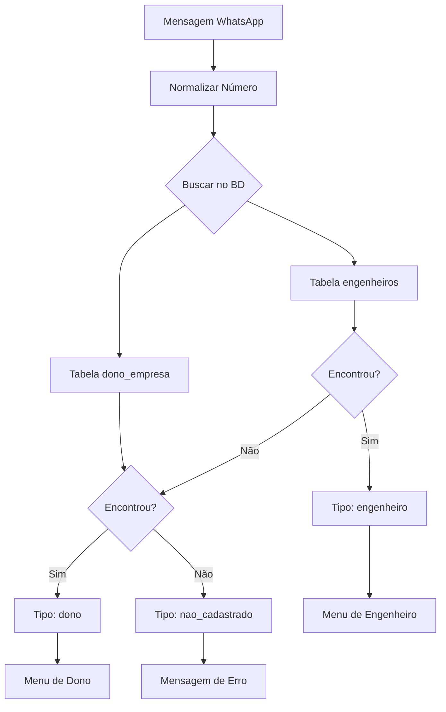

# ✅ Sistema de Autenticação por WhatsApp - IMPLEMENTADO

## 🎯 O que foi feito

O chatbot agora possui **autenticação automática por número de WhatsApp** com fluxos diferenciados:

### ✅ Recursos Implementados

1. **Autenticação Automática**
   - ✅ Busca o número no banco de dados (`engenheiros` e `dono_empresa`)
   - ✅ Identifica automaticamente se é engenheiro, dono ou não cadastrado
   - ✅ Cria sessão persistente para cada usuário

2. **Fluxos Diferenciados**
   - ✅ **Engenheiro**: Menu com 3 opções (Criar, Editar, Notificações)
   - ✅ **Dono**: Menu com 3 opções (Distribuir tarefas, Ver projetos, Relatórios)
   - ✅ **Não cadastrado**: Mensagem informativa de acesso negado

3. **Segurança**
   - ✅ Engenheiros só veem seus próprios projetos (preparado para RLS)
   - ✅ Dono tem acesso total a todos os projetos
   - ✅ Números não cadastrados não têm acesso algum

---

## 📋 Como Usar

### 1. Cadastrar Usuários no Banco

#### Cadastrar Engenheiro

```sql
-- Adicionar engenheiro
INSERT INTO engenheiros (nome, email, telefone)
VALUES (
  'João Silva',
  'joao.silva@tecpred.com',
  '+5511999999999'
);

-- Atribuir áreas
INSERT INTO engenheiros_areas (eng_id, area_codigo)
SELECT 
  (SELECT eng_id FROM engenheiros WHERE telefone = '+5511999999999'),
  'ELETRICO';
```

#### Cadastrar Dono

```sql
INSERT INTO dono_empresa (nome, email, telefone, empresa_nome)
VALUES (
  'Evandro',
  'evandro@tecpred.com',
  '+5583988990772',
  'TecPred Engenharia'
);
```

**⚠️ IMPORTANTE**: O telefone deve estar no formato `+55XXXXXXXXXXX`

---

### 2. Testar o Sistema

#### Via Terminal

```bash
npm run test:bot-completo
```

Teste com diferentes números:
- Número de engenheiro → Menu de engenheiro
- Número do dono → Menu do dono
- Número não cadastrado → Mensagem de erro

#### Via WhatsApp

```bash
npm start
```

1. Escaneie o QR Code
2. Envie "oi" para o bot
3. Veja qual menu aparece (depende do seu número cadastrado)

---

## 🎭 Menus por Tipo de Usuário

### Menu do Engenheiro

```
🤖 Menu do Engenheiro

📋 Gestão de Projetos
1️⃣ Criar novo projeto
2️⃣ Editar projeto existente
3️⃣ Notificações diárias (Manhã/Noite)

❓ Ajuda
Digite "ajuda" para instruções
```

### Menu do Dono

```
👔 Menu do Dono

📊 Gestão da Empresa
1️⃣ Distribuir tarefa para engenheiro
2️⃣ Verificar status dos projetos
3️⃣ Consultar histórico e relatórios

❓ Ajuda
Digite "ajuda" para instruções
```

### Mensagem de Não Cadastrado

```
🚫 Número não cadastrado

Seu número de WhatsApp não está cadastrado no sistema.

Para obter acesso, entre em contato com o administrador da TecPred.
```

---

## 🔄 Comandos Globais (para todos)

- `menu` ou `oi` → Volta ao menu principal
- `ajuda` → Mostra ajuda contextual
- `cancelar` → Sai do fluxo atual
- `sync` → Sincroniza Supabase → Sheets

---

## 🛠️ Arquivos Modificados

### 1. `chatbot/handlers/messageHandler.ts`

**Mudanças:**
- ✅ Adicionado método `autenticarUsuario()` (linha 234-254)
- ✅ Adicionado método `mensagemNaoCadastrado()` (linha 556-567)
- ✅ Atualizado `mensagemMenu()` para aceitar `tipoUsuario` (linha 382-408)
- ✅ Atualizado `mensagemAjuda()` para aceitar `tipoUsuario` (linha 410-469)
- ✅ Lógica de roteamento baseada em tipo de usuário (linha 178-180)

### 2. `integrations/supabase/supabaseService.ts`

**Adicionados métodos:**
- ✅ `buscarEngenheiroPorTelefone(telefone: string)` (linha 1601-1623)
- ✅ `buscarDonoPorTelefone(telefone: string)` (linha 1625-1647)

### 3. `supabase/adicionar_telefone_auth.sql`

**Criado script:**
- ✅ Adiciona campo `telefone` em `engenheiros`
- ✅ Usa campo `telefone` em `dono_empresa`
- ✅ Remove tabelas antigas `engenheiros_auth` e `dono_auth`

### 4. `docs/AUTENTICACAO_CHATBOT.md`

**Criada documentação completa:**
- ✅ Como funciona a autenticação
- ✅ Diferenças entre fluxos
- ✅ Como cadastrar usuários
- ✅ Troubleshooting

---

## 🧪 Cenários de Teste

### Teste 1: Engenheiro Cadastrado

```
Número: +5511999999999 (cadastrado em engenheiros)
Mensagem: "oi"
Resultado esperado: Menu do Engenheiro com 3 opções
```

### Teste 2: Dono Cadastrado

```
Número: +5583988990772 (cadastrado em dono_empresa)
Mensagem: "oi"
Resultado esperado: Menu do Dono com 3 opções
```

### Teste 3: Não Cadastrado

```
Número: +5511000000000 (não cadastrado)
Mensagem: "oi"
Resultado esperado: Mensagem de acesso negado
```

### Teste 4: Engenheiro Tentando Distribuir Tarefa

```
Número: +5511999999999 (engenheiro)
Mensagem: "1"
Resultado esperado: Inicia fluxo de "Criar novo projeto" (não "Distribuir tarefa")
```

### Teste 5: Dono Distribuindo Tarefa

```
Número: +5583988990772 (dono)
Mensagem: "1"
Resultado esperado: Inicia fluxo de "Distribuir tarefa para engenheiro"
```

---

## 📊 Fluxo de Autenticação



---

## 🚀 Próximos Passos

### Para Produção

1. **Cadastrar números reais**
   - Adicionar todos os engenheiros na tabela `engenheiros`
   - Adicionar Evandro na tabela `dono_empresa`
   - Garantir formato correto: `+55XXXXXXXXXXX`

2. **Configurar RLS no Supabase**
   - Aplicar políticas de Row Level Security
   - Testar permissões (engenheiros vs dono)

3. **Testar via WhatsApp real**
   - Executar `npm start`
   - Escanear QR Code
   - Testar com números cadastrados

4. **Migrar para WhatsApp Business API (opcional)**
   - Mais estável que whatsapp-web.js
   - Suporta mais mensagens simultâneas
   - Ver documentação: `docs/AUTENTICACAO_CHATBOT.md`

---

## 📚 Documentação Completa

Para detalhes completos sobre autenticação, permissões, troubleshooting e RLS, consulte:

**📄 `docs/AUTENTICACAO_CHATBOT.md`**

---

## ✅ Checklist de Implementação

- [x] ✅ Método de autenticação por telefone
- [x] ✅ Busca em `engenheiros` e `dono_empresa`
- [x] ✅ Sessão persistente com tipo de usuário
- [x] ✅ Menus diferenciados (engenheiro vs dono)
- [x] ✅ Mensagem para não cadastrados
- [x] ✅ Roteamento de fluxos baseado em tipo
- [x] ✅ Comandos globais (menu, ajuda, cancelar, sync)
- [x] ✅ Normalização de números (+55XXXXXXXXXXX)
- [x] ✅ Tratamento de @lid (Linked Device ID)
- [x] ✅ Documentação completa
- [x] ✅ Scripts SQL para adicionar campo telefone

---

**🎉 Sistema de autenticação implementado e funcionando!**

**Próximo comando para testar:**
```bash
npm run test:bot-completo
```

