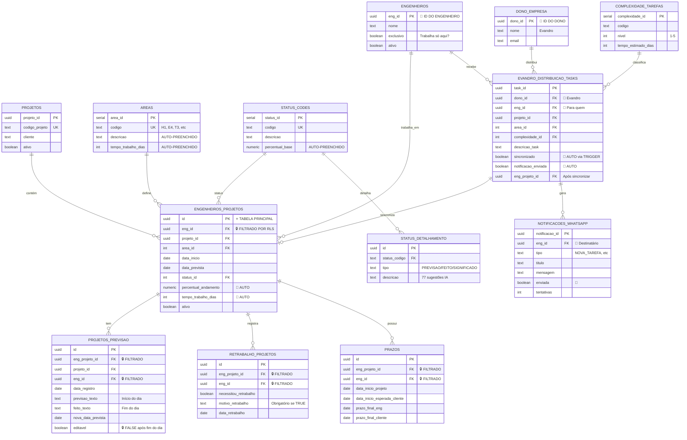

# 🗺️ Diagrama Completo do Banco de Dados

## Visão Geral da Arquitetura

```
┌─────────────────────────────────────────────────────────────────┐
│                    CAMADA DE ACESSO                              │
│                                                                  │
│  ┌──────────────────┐              ┌──────────────────┐         │
│  │  ENGENHEIRO      │              │  DONO (EVANDRO)  │         │
│  │  eng_id = X      │              │  dono_id = Y     │         │
│  │  [LIMITADO]      │              │  [ACESSO TOTAL]  │         │
│  └────────┬─────────┘              └────────┬─────────┘         │
│           │                                 │                   │
│           │ Row Level Security (RLS)        │                   │
│           │ WHERE eng_id = auth.uid()       │ Sem restrições    │
└───────────┼─────────────────────────────────┼───────────────────┘
            │                                 │
            ↓                                 ↓
┌───────────────────────────────────────────────────────────────────┐
│                    CAMADA DE DADOS                                │
│                   (PostgreSQL/Supabase)                           │
└───────────────────────────────────────────────────────────────────┘
```

---

## 📊 Diagrama ER Completo



---

## 🔄 Fluxo de Dados: Chatbot → Banco de Dados

### 1. Engenheiro Registra Previsão

```
┌──────────────────────────────────────────────────────────────────┐
│ ENGENHEIRO (WhatsApp)                                             │
│ eng_id: abc-123                                                   │
└────────────────┬─────────────────────────────────────────────────┘
                 │
                 │ "Previsão de hoje para PRJ-001"
                 ↓
┌────────────────────────────────────────────────────────────────────┐
│ CHATBOT (LLM - Claude/GPT)                                         │
│                                                                    │
│ 1. Identifica intenção: registrar_previsao                        │
│ 2. Extrai entidades:                                               │
│    • eng_id: abc-123 (do contexto da sessão)                       │
│    • projeto: PRJ-001                                              │
│ 3. Busca atribuição:                                               │
│    SELECT id FROM engenheiros_projetos                             │
│    WHERE eng_id = 'abc-123' AND projeto_id = ...                   │
└────────────────┬───────────────────────────────────────────────────┘
                 │
                 │ Chama function PostgreSQL
                 ↓
┌────────────────────────────────────────────────────────────────────┐
│ FUNCTION: registrar_previsao_dia_com_sugestoes()                   │
│                                                                    │
│ 1. Valida eng_projeto_id                                           │
│ 2. Busca status_id atual                                           │
│ 3. Se previsão vazia → retorna sugestões IA                        │
│ 4. Se preenchida → INSERT em projetos_previsao                     │
└────────────────┬───────────────────────────────────────────────────┘
                 │
                 │ Se vazio
                 ↓
┌────────────────────────────────────────────────────────────────────┐
│ FUNCTION: sugerir_previsoes_por_status('EM_EXECUCAO')             │
│                                                                    │
│ SELECT descricao                                                   │
│ FROM status_detalhamento                                           │
│ WHERE status_codigo = 'EM_EXECUCAO'                                │
│ AND tipo = 'PREVISAO'                                              │
│                                                                    │
│ RETORNA: 16 sugestões numeradas                                    │
└────────────────┬───────────────────────────────────────────────────┘
                 │
                 │ Retorno JSON
                 ↓
┌────────────────────────────────────────────────────────────────────┐
│ CHATBOT formata resposta                                           │
│                                                                    │
│ "Sugestões de previsão:                                            │
│  1️⃣ Solicitar planta baixa                                         │
│  2️⃣ Checar compatibilização                                        │
│  3️⃣ Preparar checklist                                             │
│  ..."                                                              │
└────────────────┬───────────────────────────────────────────────────┘
                 │
                 ↓
┌────────────────────────────────────────────────────────────────────┐
│ ENGENHEIRO escolhe: "3"                                            │
└────────────────┬───────────────────────────────────────────────────┘
                 │
                 │ "Preparar checklist"
                 ↓
┌────────────────────────────────────────────────────────────────────┐
│ INSERT INTO projetos_previsao                                      │
│                                                                    │
│ • eng_projeto_id: def-456                                          │
│ • projeto_id: xyz-789 (🤖 AUTO via TRIGGER)                        │
│ • eng_id: abc-123 (🤖 AUTO via TRIGGER)                            │
│ • data_registro: 2025-12-19                                        │
│ • previsao_texto: "Preparar checklist"                             │
│ • editavel: TRUE                                                   │
│                                                                    │
│ 🔒 RLS: WHERE eng_id = auth.uid()                                  │
└────────────────┬───────────────────────────────────────────────────┘
                 │
                 │ Success
                 ↓
┌────────────────────────────────────────────────────────────────────┐
│ CHATBOT: "✅ Previsão registrada!"                                 │
└────────────────────────────────────────────────────────────────────┘
```

---

## 🔐 Sistema de Permissões (RLS - Row Level Security)

### Políticas por Tabela

```sql
-- ================================================
-- ENGENHEIROS_PROJETOS
-- ================================================

-- Política para ENGENHEIROS (LIMITADO)
ALTER TABLE engenheiros_projetos ENABLE ROW LEVEL SECURITY;

CREATE POLICY "eng_see_own_projects"
ON engenheiros_projetos FOR SELECT
USING (
    eng_id = auth.uid()  -- 🔒 Só vê seus próprios projetos
);

CREATE POLICY "eng_update_own_projects"
ON engenheiros_projetos FOR UPDATE
USING (
    eng_id = auth.uid()  -- 🔒 Só edita seus projetos
);

-- Política para DONO (ACESSO TOTAL)
CREATE POLICY "dono_see_all_projects"
ON engenheiros_projetos FOR SELECT
USING (
    EXISTS (
        SELECT 1 FROM dono_empresa
        WHERE dono_id = auth.uid()  -- 👔 Dono vê TUDO
    )
);

-- ================================================
-- PROJETOS_PREVISAO
-- ================================================

CREATE POLICY "eng_see_own_previsoes"
ON projetos_previsao FOR SELECT
USING (
    eng_id = auth.uid()  -- 🔒 Só vê suas previsões
);

CREATE POLICY "eng_insert_own_previsoes"
ON projetos_previsao FOR INSERT
WITH CHECK (
    eng_id = auth.uid()  -- 🔒 Só insere suas previsões
);

CREATE POLICY "eng_update_own_previsoes"
ON projetos_previsao FOR UPDATE
USING (
    eng_id = auth.uid()
    AND editavel = TRUE  -- 🔒 E só se editável
);

CREATE POLICY "dono_see_all_previsoes"
ON projetos_previsao FOR SELECT
USING (
    EXISTS (
        SELECT 1 FROM dono_empresa
        WHERE dono_id = auth.uid()  -- 👔 Dono vê TUDO
    )
);

-- ================================================
-- RETRABALHO_PROJETOS
-- ================================================

CREATE POLICY "eng_see_own_retrabalhos"
ON retrabalho_projetos FOR SELECT
USING (
    eng_id = auth.uid()  -- 🔒 Só vê seus retrabalhos
);

CREATE POLICY "dono_see_all_retrabalhos"
ON retrabalho_projetos FOR SELECT
USING (
    EXISTS (
        SELECT 1 FROM dono_empresa
        WHERE dono_id = auth.uid()  -- 👔 Dono vê TUDO
    )
);

-- ================================================
-- EVANDRO_DISTRIBUICAO_TASKS
-- ================================================

CREATE POLICY "dono_manage_tasks"
ON evandro_distribuicao_tasks FOR ALL
USING (
    dono_id = auth.uid()  -- 👔 Só dono gerencia tasks
);

CREATE POLICY "eng_see_own_tasks"
ON evandro_distribuicao_tasks FOR SELECT
USING (
    eng_id = auth.uid()  -- 👤 Eng vê tasks atribuídas a ele
);
```

### Visualização das Permissões

```
┌─────────────────────────────────────────────────────────────────┐
│                        PERMISSÕES                                │
└─────────────────────────────────────────────────────────────────┘

ENGENHEIRO (eng_id = abc-123)
│
├─ ✅ VER: Seus próprios projetos (WHERE eng_id = 'abc-123')
│   └─ engenheiros_projetos
│   └─ projetos_previsao
│   └─ retrabalho_projetos
│   └─ prazos
│
├─ ✅ EDITAR: Seus próprios projetos
│   └─ engenheiros_projetos (data_prevista, status_id)
│   └─ projetos_previsao (SE editavel = TRUE)
│
├─ ✅ INSERIR: Registros próprios
│   └─ projetos_previsao (nova previsão)
│   └─ retrabalho_projetos (novo retrabalho)
│
└─ ❌ BLOQUEADO:
    └─ Projetos de outros engenheiros
    └─ Distribuição de tarefas (dono_empresa)
    └─ Editar previsões após fim do dia (editavel = FALSE)

─────────────────────────────────────────────────────────────────

DONO/EVANDRO (dono_id = xyz-789)
│
├─ ✅ VER: TUDO (sem restrições)
│   └─ Todos os engenheiros
│   └─ Todos os projetos
│   └─ Todas as previsões
│   └─ Todos os retrabalhos
│   └─ Todos os prazos
│   └─ Todas as estatísticas
│
├─ ✅ EDITAR: Permissões administrativas
│   └─ evandro_distribuicao_tasks
│   └─ dono_empresa
│   └─ complexidade_tarefas
│
├─ ✅ INSERIR:
│   └─ evandro_distribuicao_tasks (distribuir novas tarefas)
│   └─ notificacoes_whatsapp (via trigger automático)
│
└─ ✅ ACESSO TOTAL: Todas as views
    └─ vw_dono_visao_geral
    └─ vw_dono_engenheiro_detalhado
    └─ vw_dono_retrabalhos_historico
    └─ vw_quantidade_retrabalhos
```

---

## 🔄 Fluxo: Dono Distribui Tarefa

```
┌────────────────────────────────────────────────────────────────┐
│ DONO (WhatsApp)                                                 │
│ dono_id: evandro-123                                            │
│ 🔑 ACESSO TOTAL                                                 │
└────────────┬───────────────────────────────────────────────────┘
             │
             │ "Atribuir E4 do PRJ-001 para Ana Santos"
             ↓
┌────────────────────────────────────────────────────────────────┐
│ CHATBOT extrai:                                                 │
│ • dono_id: evandro-123                                          │
│ • eng: Ana Santos → busca eng_id                                │
│ • projeto: PRJ-001 → busca projeto_id                           │
│ • área: E4                                                      │
└────────────┬───────────────────────────────────────────────────┘
             │
             ↓
┌────────────────────────────────────────────────────────────────┐
│ FUNCTION: dono_distribuir_tarefa()                              │
│                                                                 │
│ INSERT INTO evandro_distribuicao_tasks (                        │
│   dono_id: evandro-123,      ← 👔 Quem distribuiu              │
│   eng_id: ana-456,           ← 👤 Para quem                     │
│   projeto_id: proj-789,                                         │
│   area_id: 4,                ← E4                               │
│   descricao_task: ...,                                          │
│   sincronizado: FALSE        ← Ainda não                        │
│ )                                                               │
└────────────┬───────────────────────────────────────────────────┘
             │
             │ 🔄 TRIGGER AUTOMÁTICO
             ↓
┌────────────────────────────────────────────────────────────────┐
│ TRIGGER: sincronizar_task_para_engenheiro()                     │
│                                                                 │
│ 1️⃣ Cria projeto se não existir                                 │
│    INSERT INTO projetos IF NOT EXISTS                           │
│                                                                 │
│ 2️⃣ Busca status inicial                                         │
│    status_id = 'AGUARDANDO_INICIO'                              │
│                                                                 │
│ 3️⃣ Cria em engenheiros_projetos                                 │
│    INSERT INTO engenheiros_projetos (                           │
│      eng_id: ana-456,                                           │
│      projeto_id: proj-789,                                      │
│      area_id: 4,              ← E4                              │
│      status_id: 1             ← Aguardando Início               │
│    )                                                            │
│                                                                 │
│ 4️⃣ TRIGGERS automáticos cascateiam:                             │
│    • trg_calcular_tempo_trabalho                                │
│      → SELECT tempo_trabalho_dias FROM areas WHERE area_id = 4  │
│      → tempo_trabalho_dias = 25 ✅                               │
│                                                                 │
│    • trg_calcular_percentual_status                             │
│      → SELECT percentual_base FROM status_codes WHERE...        │
│      → percentual_andamento = 0.00 ✅                            │
│                                                                 │
│    • trg_preencher_vars_*                                       │
│      → projeto_id, eng_id preenchidos em todas as tabelas       │
│                                                                 │
│ 5️⃣ Atualiza task                                                │
│    UPDATE evandro_distribuicao_tasks SET                        │
│      eng_projeto_id = (id criado),                              │
│      sincronizado = TRUE ✅                                      │
│                                                                 │
│ 6️⃣ Cria notificação WhatsApp                                    │
│    INSERT INTO notificacoes_whatsapp (                          │
│      eng_id: ana-456,                                           │
│      tipo: 'NOVA_TAREFA',                                       │
│      titulo: '🆕 Nova Tarefa Atribuída!',                       │
│      mensagem: 'Projeto: PRJ-001, Área: E4...',                 │
│      enviada: FALSE                                             │
│    )                                                            │
└────────────┬───────────────────────────────────────────────────┘
             │
             │ 📱 Webhook processa fila (a cada 30s)
             ↓
┌────────────────────────────────────────────────────────────────┐
│ WEBHOOK (Node.js/Python)                                        │
│                                                                 │
│ SELECT * FROM notificacoes_whatsapp                             │
│ WHERE enviada = FALSE                                           │
│                                                                 │
│ → Envia via Evolution API / Twilio                              │
│ → UPDATE notificacoes_whatsapp SET enviada = TRUE               │
└────────────┬───────────────────────────────────────────────────┘
             │
             │ 📱 WhatsApp
             ↓
┌────────────────────────────────────────────────────────────────┐
│ ANA SANTOS recebe notificação                                   │
│                                                                 │
│ "🆕 Nova Tarefa Atribuída por Evandro!                          │
│  📋 Projeto: PRJ-001                                            │
│  📦 Área: E4 - Elétrico                                         │
│  ⏱️ Tempo: 25 dias"                                             │
└────────────┬───────────────────────────────────────────────────┘
             │
             │ Ana consulta chatbot
             ↓
┌────────────────────────────────────────────────────────────────┐
│ ANA (WhatsApp): "Meus projetos"                                 │
│                                                                 │
│ → CHATBOT busca com eng_id = ana-456                            │
│ → SELECT * FROM vw_engenheiros_projetos                         │
│   WHERE eng_id = 'ana-456'  🔒 RLS aplicado                     │
│                                                                 │
│ → ✨ Nova tarefa JÁ APARECE!                                    │
└────────────────────────────────────────────────────────────────┘
```

---

## 🔄 Fluxo: Variáveis Compartilhadas (Automático)

```
┌────────────────────────────────────────────────────────────────┐
│ PROBLEMA: Múltiplas tabelas precisam de projeto_id e eng_id    │
│                                                                 │
│ ❌ Solução ruim: Engenheiro preencher manualmente              │
│ ✅ Solução implementada: TRIGGERS automáticos                   │
└────────────────────────────────────────────────────────────────┘

EXEMPLO: Inserir previsão diária

┌────────────────────────────────────────────────────────────────┐
│ INPUT do engenheiro via chatbot:                                │
│ • eng_projeto_id: def-456                                       │
│ • previsao_texto: "Realizar traçado"                            │
│ • (projeto_id NÃO fornecido)                                    │
│ • (eng_id NÃO fornecido)                                        │
└────────────┬───────────────────────────────────────────────────┘
             │
             ↓
┌────────────────────────────────────────────────────────────────┐
│ INSERT INTO projetos_previsao (                                 │
│   eng_projeto_id: def-456,                                      │
│   previsao_texto: "Realizar traçado"                            │
│   -- projeto_id e eng_id ausentes!                              │
│ )                                                               │
└────────────┬───────────────────────────────────────────────────┘
             │
             │ 🔄 TRIGGER: trg_preencher_vars_previsao
             ↓
┌────────────────────────────────────────────────────────────────┐
│ FUNCTION: preencher_variaveis_compartilhadas()                  │
│                                                                 │
│ SELECT projeto_id, eng_id                                       │
│ FROM engenheiros_projetos                                       │
│ WHERE id = 'def-456'                                            │
│                                                                 │
│ RETORNA:                                                        │
│ • projeto_id: proj-789                                          │
│ • eng_id: ana-456                                               │
│                                                                 │
│ NEW.projeto_id := proj-789  🤖 AUTO                             │
│ NEW.eng_id := ana-456       🤖 AUTO                             │
└────────────┬───────────────────────────────────────────────────┘
             │
             ↓
┌────────────────────────────────────────────────────────────────┐
│ RESULTADO FINAL em projetos_previsao:                           │
│                                                                 │
│ • eng_projeto_id: def-456     (fornecido)                       │
│ • projeto_id: proj-789        (🤖 AUTO via TRIGGER)             │
│ • eng_id: ana-456             (🤖 AUTO via TRIGGER)             │
│ • previsao_texto: "Realizar traçado"                            │
│ • data_registro: 2025-12-19                                     │
│ • editavel: TRUE                                                │
│                                                                 │
│ ✅ RLS funciona: WHERE eng_id = 'ana-456'                       │
└────────────────────────────────────────────────────────────────┘

MESMO PROCESSO para:
• retrabalho_projetos
• prazos
```

---

## 📊 Diagrama de Conexões: Tabela Central

```
                    ┌─────────────────────────────┐
                    │      ENGENHEIROS            │
                    │      eng_id (PK) 🔑         │
                    │      nome                   │
                    │      exclusivo              │
                    └─────────────┬───────────────┘
                                  │
                                  │ 1:N
                                  ↓
                    ┌─────────────────────────────┐
                    │   ENGENHEIROS_PROJETOS      │
                    │   ⭐ TABELA CENTRAL          │
                    │                             │
                    │   id (PK)                   │
                    │   eng_id (FK) 🔒            │
                    │   projeto_id (FK)           │
                    │   area_id (FK)              │
                    │   status_id (FK)            │
                    │   tempo_trabalho_dias 🤖     │
                    │   percentual_andamento 🤖    │
                    └─────────────┬───────────────┘
                                  │
        ┌─────────────┬───────────┼───────────┬─────────────┐
        │             │           │           │             │
        │ 1:N         │ 1:N       │ 1:N       │ 1:N         │ 1:N
        ↓             ↓           ↓           ↓             ↓
  ┌──────────┐  ┌──────────┐ ┌──────────┐ ┌──────────┐ ┌──────────┐
  │ PROJETOS │  │  AREAS   │ │ STATUS   │ │PREVISÕES │ │RETRABALHOS│
  │ _PREVISAO│  │          │ │  _CODES  │ │          │ │          │
  │          │  │ codigo🔑 │ │          │ │ editavel │ │ contador │
  │ previsao │  │ descr 🤖 │ │ %base 🤖 │ │ 🔒       │ │ 🤖       │
  │ feito    │  │ dias 🤖  │ │          │ │          │ │          │
  │ nova_data│  │          │ │ sugestões│ │          │ │          │
  │          │  │          │ │ 77 IA 🤖 │ │          │ │          │
  └──────────┘  └──────────┘ └──────────┘ └──────────┘ └──────────┘
       │                                        │
       │ eng_id 🔒                              │ eng_id 🔒
       │ projeto_id                             │ projeto_id
       │ (AUTO via TRIGGER)                     │ (AUTO via TRIGGER)
       └────────────────────────────────────────┘

LEGENDA:
🔑 Primary Key
🔒 Filtrado por RLS (WHERE eng_id = auth.uid())
🤖 Preenchido automaticamente via TRIGGER
⭐ Tabela principal do sistema
```

---

## 🔐 Resumo de Permissões RLS

### ENGENHEIRO (eng_id = X)

```sql
-- O que ele VÊ:
SELECT * FROM engenheiros_projetos
WHERE eng_id = auth.uid();  -- Só os dele! 🔒

SELECT * FROM projetos_previsao
WHERE eng_id = auth.uid();  -- Só os dele! 🔒

SELECT * FROM retrabalho_projetos
WHERE eng_id = auth.uid();  -- Só os dele! 🔒

SELECT * FROM prazos
WHERE eng_id = auth.uid();  -- Só os dele! 🔒

-- O que ele NÃO VÊ:
❌ Projetos de outros engenheiros
❌ Previsões de outros engenheiros
❌ Retrabalhos de outros engenheiros
❌ Estatísticas gerais (views do dono)
❌ Fila de notificações
❌ Distribuição de tarefas (exceto as dele)
```

### DONO/EVANDRO (dono_id = Y)

```sql
-- O que ele VÊ:
SELECT * FROM engenheiros_projetos;  -- TUDO! ✅
SELECT * FROM projetos_previsao;     -- TUDO! ✅
SELECT * FROM retrabalho_projetos;   -- TUDO! ✅
SELECT * FROM prazos;                -- TUDO! ✅

-- Views exclusivas do dono:
SELECT * FROM vw_dono_visao_geral;              ✅
SELECT * FROM vw_dono_engenheiro_detalhado;     ✅
SELECT * FROM vw_dono_retrabalhos_historico;    ✅
SELECT * FROM vw_quantidade_retrabalhos;        ✅
SELECT * FROM vw_dono_taxa_execucao_ranking;    ✅

-- Ações exclusivas:
INSERT INTO evandro_distribuicao_tasks (...);   ✅
UPDATE complexidade_tarefas ...;                ✅
```

---

## 🎯 Exemplo Prático: Dois Engenheiros

```
┌─────────────────────────────────────────────────────────────────┐
│ BANCO DE DADOS (estado atual)                                   │
└─────────────────────────────────────────────────────────────────┘

engenheiros_projetos:
┌──────────┬─────────┬───────────┬──────┬────────┬──────┬───────┐
│ id       │ eng_id  │projeto_id │ area │ status │ %    │ dias  │
├──────────┼─────────┼───────────┼──────┼────────┼──────┼───────┤
│ aaa-111  │ ana-456 │ prj-001   │ H4   │ Em Exe │ 50%  │ 17    │
│ bbb-222  │ ana-456 │ prj-002   │ E2   │ Aguard │ 0%   │ 15    │
│ ccc-333  │ joao-789│ prj-001   │ T3   │ Em Exe │ 75%  │ 3     │
│ ddd-444  │ joao-789│ prj-003   │ G2   │ Concl  │ 100% │ 1     │
└──────────┴─────────┴───────────┴──────┴────────┴──────┴───────┘

projetos_previsao:
┌──────────┬─────────────┬─────────┬───────────┬───────────────┐
│ id       │eng_projeto_id│ eng_id │projeto_id │ previsao      │
├──────────┼─────────────┼─────────┼───────────┼───────────────┤
│ ppp-111  │ aaa-111     │ ana-456 │ prj-001   │ Traçado...    │
│ ppp-222  │ aaa-111     │ ana-456 │ prj-001   │ Detalhamento..│
│ ppp-333  │ ccc-333     │ joao-789│ prj-001   │ Telefonia...  │
└──────────┴─────────────┴─────────┴───────────┴───────────────┘

┌─────────────────────────────────────────────────────────────────┐
│ ANA consulta: "Meus projetos"                                    │
│ auth.uid() = ana-456                                             │
└─────────────────────────────────────────────────────────────────┘

SELECT * FROM engenheiros_projetos
WHERE eng_id = 'ana-456';  -- 🔒 RLS aplicado

RESULTADO:
┌──────────┬─────────┬───────────┬──────┬────────┬──────┬───────┐
│ aaa-111  │ ana-456 │ prj-001   │ H4   │ Em Exe │ 50%  │ 17    │ ✅
│ bbb-222  │ ana-456 │ prj-002   │ E2   │ Aguard │ 0%   │ 15    │ ✅
└──────────┴─────────┴───────────┴──────┴────────┴──────┴───────┘
           ❌ Não vê projetos do João (ccc-333, ddd-444)

┌─────────────────────────────────────────────────────────────────┐
│ JOÃO consulta: "Meus projetos"                                   │
│ auth.uid() = joao-789                                            │
└─────────────────────────────────────────────────────────────────┘

SELECT * FROM engenheiros_projetos
WHERE eng_id = 'joao-789';  -- 🔒 RLS aplicado

RESULTADO:
┌──────────┬─────────┬───────────┬──────┬────────┬──────┬───────┐
│ ccc-333  │ joao-789│ prj-001   │ T3   │ Em Exe │ 75%  │ 3     │ ✅
│ ddd-444  │ joao-789│ prj-003   │ G2   │ Concl  │ 100% │ 1     │ ✅
└──────────┴─────────┴───────────┴──────┴────────┴──────┴───────┘
           ❌ Não vê projetos da Ana (aaa-111, bbb-222)

┌─────────────────────────────────────────────────────────────────┐
│ EVANDRO consulta: "Status de todos"                              │
│ auth.uid() = evandro-123 (dono)                                  │
└─────────────────────────────────────────────────────────────────┘

SELECT * FROM engenheiros_projetos;  -- SEM filtro RLS

RESULTADO:
┌──────────┬─────────┬───────────┬──────┬────────┬──────┬───────┐
│ aaa-111  │ ana-456 │ prj-001   │ H4   │ Em Exe │ 50%  │ 17    │ ✅
│ bbb-222  │ ana-456 │ prj-002   │ E2   │ Aguard │ 0%   │ 15    │ ✅
│ ccc-333  │ joao-789│ prj-001   │ T3   │ Em Exe │ 75%  │ 3     │ ✅
│ ddd-444  │ joao-789│ prj-003   │ G2   │ Concl  │ 100% │ 1     │ ✅
└──────────┴─────────┴───────────┴──────┴────────┴──────┴───────┘
           ✅ VÊ TUDO!
```

---

## 🎯 Conclusão

### Segurança Implementada

✅ **Engenheiros** veem apenas seus projetos (eng_id filtrado)  
✅ **Dono** vê tudo (sem restrições)  
✅ **Previsões** são imutáveis após fim do dia (editavel = FALSE)  
✅ **Variáveis compartilhadas** preenchidas automaticamente  
✅ **Tempo e percentual** calculados via triggers  
✅ **Notificações** enviadas automaticamente  

### Automações Implementadas

🤖 **9 Triggers** funcionando  
🤖 **Variáveis compartilhadas** (projeto_id, eng_id)  
🤖 **Tempo de trabalho** (da área)  
🤖 **Percentual** (do status)  
🤖 **Sincronização** dono → engenheiro  
🤖 **Notificações** WhatsApp  
🤖 **Sugestões de IA** (77 atividades)  
🤖 **Contador de retrabalhos** (via COUNT)  

---

**🔒 Sistema seguro e 100% automatizado!**
