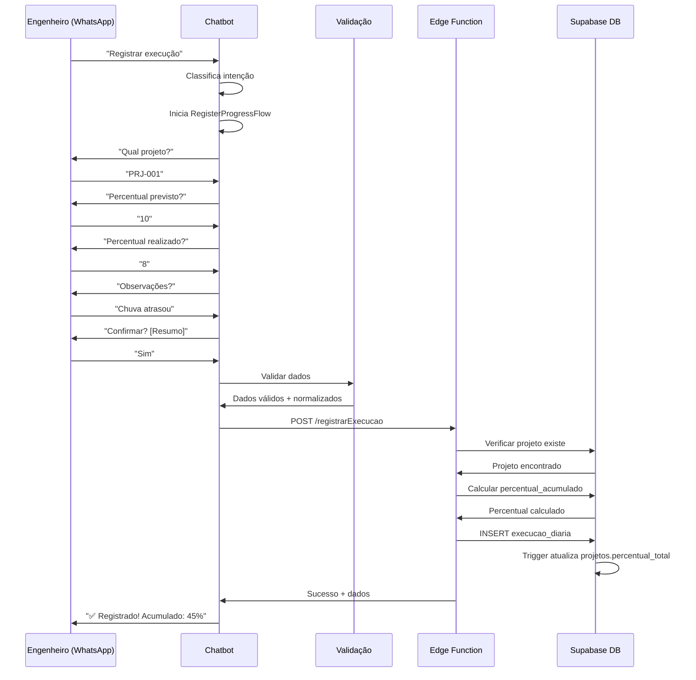
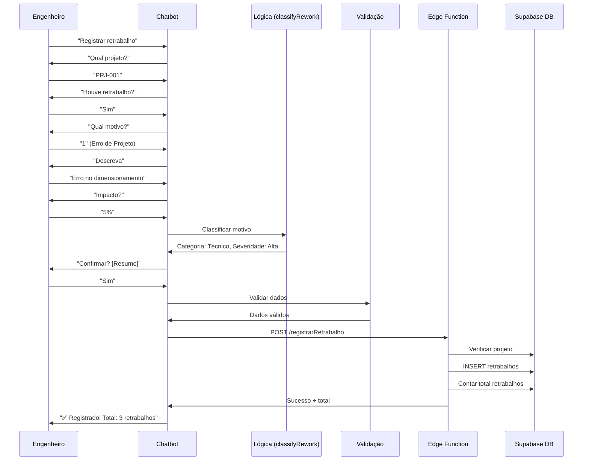
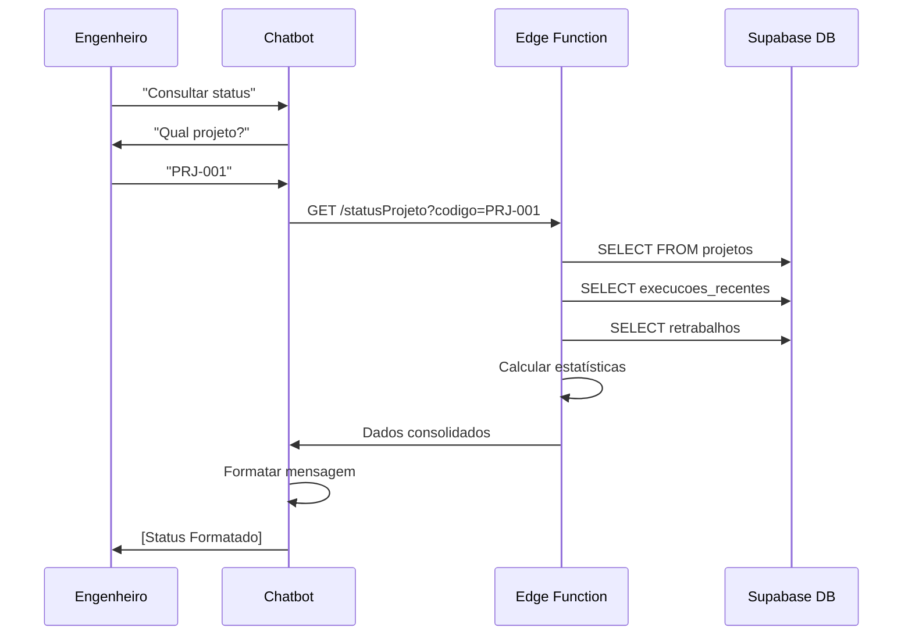
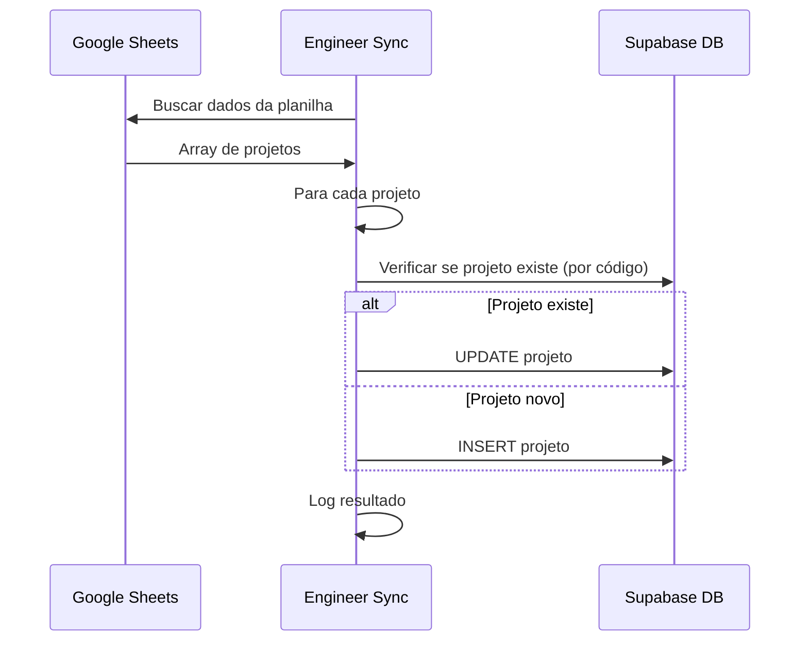
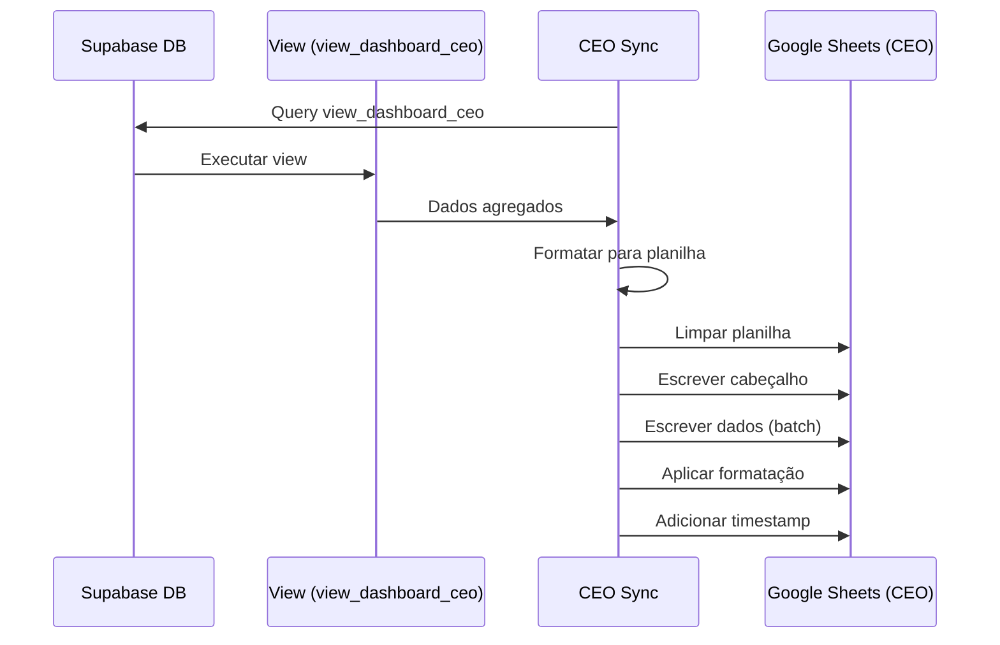

# 🔄 Fluxo de Dados - Chatbot Tril Consult

## Visão Geral

Este documento descreve todos os fluxos de dados do sistema, desde a entrada via WhatsApp até o armazenamento e visualização.

---

## Fluxo 1: Registro de Execução Diária



### Dados Transformados

**Entrada (WhatsApp)**:
- Mensagens em texto livre
- Formato humano

**Processamento (Chatbot)**:
- Extração de números
- Normalização de datas
- Validação de ranges

**Armazenamento (Banco)**:
- UUIDs
- Timestamps com timezone
- Percentuais como NUMERIC(5,2)

---

## Fluxo 2: Registro de Retrabalho



### Classificação Automática

```
Input: motivo + descricao
 ↓
Análise NLP (palavras-chave)
 ↓
Categoria + Subcategoria + Severidade
 ↓
Sugestão Preventiva
```

---

## Fluxo 3: Consulta de Status



### Dados Agregados

```sql
-- Estatísticas calculadas
SELECT 
  p.percentual_total,
  COUNT(e.id) as total_dias,
  AVG(e.percentual_realizado) as media_diaria,
  MAX(e.data) as ultima_atualizacao,
  COUNT(r.id) as total_retrabalhos,
  SUM(r.impacto_percentual) as impacto_total
FROM projetos p
LEFT JOIN execucao_diaria e ON p.id = e.projeto_id
LEFT JOIN retrabalhos r ON p.id = r.projeto_id
WHERE p.codigo = 'PRJ-001'
GROUP BY p.id
```

---

## Fluxo 4: Sincronização Engenheiros → Supabase



### Mapeamento de Dados

**Google Sheets**:
| Col A | Col B | Col C | Col D | Col E | Col F | Col G |
|-------|-------|-------|-------|-------|-------|-------|
| PRJ-001 | Nome | Cliente | Área | Tipo | Status | 45% |

**Supabase**:
```typescript
{
  codigo: "PRJ-001",
  nome: "Nome",
  cliente: "Cliente",
  area: "Área",
  tipo_obra: "Tipo",
  status: "Status",
  percentual_total: 45.0,
  engenheiro_id: "uuid"
}
```

---

## Fluxo 5: Sincronização Supabase → CEO



### View Dashboard CEO

```sql
CREATE VIEW view_dashboard_ceo AS
SELECT 
    p.codigo AS "Código Projeto",
    p.nome AS "Nome Projeto",
    p.cliente AS "Cliente",
    e.nome AS "Engenheiro",
    p.area AS "Área",
    p.percentual_total AS "% Concluído",
    MAX(ed.data) AS "Última Atualização",
    COUNT(r.id) AS "Total Retrabalhos",
    SUM(r.impacto_percentual) AS "Impacto Retrabalho (%)",
    CASE 
        WHEN MAX(ed.data) >= CURRENT_DATE - 3 THEN 'Ativo'
        ELSE 'Inativo'
    END AS "Situação"
FROM projetos p
JOIN engenheiros e ON p.engenheiro_id = e.id
LEFT JOIN execucao_diaria ed ON p.id = ed.projeto_id
LEFT JOIN retrabalhos r ON p.id = r.projeto_id
GROUP BY p.id, e.nome
ORDER BY p.percentual_total DESC
```

---

## Transformações de Dados

### 1. Normalização de Datas

```typescript
// Input variados
"15/01/2024"
"2024-01-15"
"15-01-2024"

// Output padronizado
"2024-01-15" (ISO 8601)
```

### 2. Normalização de WhatsApp

```typescript
// Input variados
"11999999999"
"(11) 99999-9999"
"+55 11 99999-9999"

// Output padronizado
"+5511999999999"
```

### 3. Normalização de Percentuais

```typescript
// Input variados
"10"
"10%"
"10.5"
"10,5"

// Output padronizado
10.00 (NUMERIC)
```

---

## Caching e Performance

### Sessões do Chatbot

```typescript
{
  whatsapp: "+5511999999999",
  fluxo_ativo: "progress",
  instancia_fluxo: RegisterProgressFlow,
  ultima_interacao: Date,
  timeout: 15 minutos
}
```

**Limpeza**: A cada 5 minutos, sessões antigas são removidas

### Índices do Banco

```sql
-- Otimizar queries frequentes
CREATE INDEX idx_execucao_projeto_data 
    ON execucao_diaria(projeto_id, data DESC);

CREATE INDEX idx_projetos_engenheiro 
    ON projetos(engenheiro_id);
```

---

## Triggers Automáticos

### 1. Atualizar Percentual Total

```sql
CREATE TRIGGER trigger_atualizar_percentual_projeto
    AFTER INSERT OR UPDATE ON execucao_diaria
    FOR EACH ROW
    EXECUTE FUNCTION atualizar_percentual_projeto();
```

**Ação**: Quando uma execução é registrada, atualiza automaticamente `projetos.percentual_total`

### 2. Atualizar Timestamp

```sql
CREATE TRIGGER update_projetos_updated_at 
    BEFORE UPDATE ON projetos
    FOR EACH ROW 
    EXECUTE FUNCTION update_updated_at_column();
```

**Ação**: Atualiza campo `updated_at` em toda modificação

---

## Validação em Camadas

```
Input do Usuário
       ↓
1. Chatbot (Formato básico)
   - Tipo de dado correto
   - Range válido
       ↓
2. Logic Layer (Regras de negócio)
   - Validações complexas
   - Normalização
       ↓
3. Edge Function (Final)
   - Verificar existência de recursos
   - Integridade referencial
       ↓
4. Banco de Dados (Constraints)
   - CHECK constraints
   - FOREIGN KEYS
   - UNIQUE constraints
```

---

## Tratamento de Erros

### Propagação de Erros

```
Banco de Dados (PostgreSQL Error)
       ↓
Edge Function (Catch + Format)
       ↓
Chatbot (User-friendly message)
       ↓
Usuário (Mensagem clara em português)
```

### Exemplo

```
DB: "duplicate key value violates unique constraint"
  ↓
EF: { error: "Registro duplicado" }
  ↓
Chatbot: "❌ Já existe um registro para este projeto hoje"
```

---

## Monitoramento e Logs

### Logs das Edge Functions

```typescript
console.log('Request recebido:', body);
console.log('Execução registrada:', resultado);
console.error('Erro ao inserir:', error);
```

**Acesso**: Supabase Dashboard → Edge Functions → Logs

### Logs do Chatbot

```typescript
console.log(`Sessão criada: ${whatsapp}`);
console.log(`Fluxo iniciado: ${tipo_fluxo}`);
console.log(`${n} sessões antigas removidas`);
```

---

**Última atualização**: Novembro 2024

