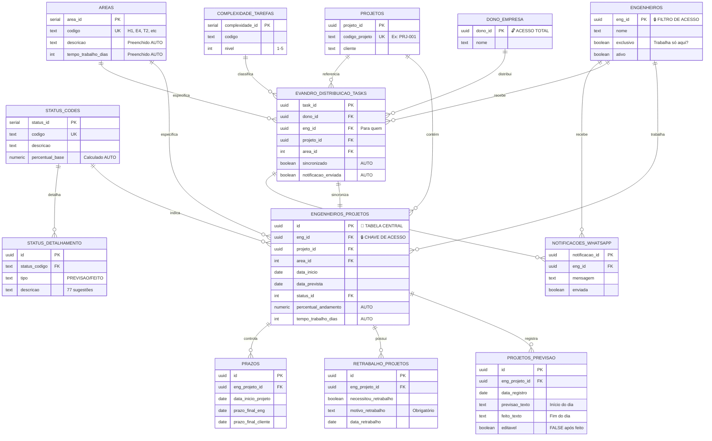
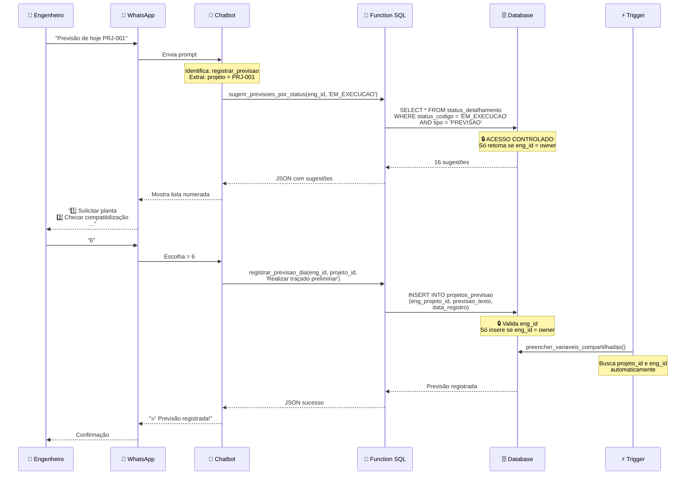
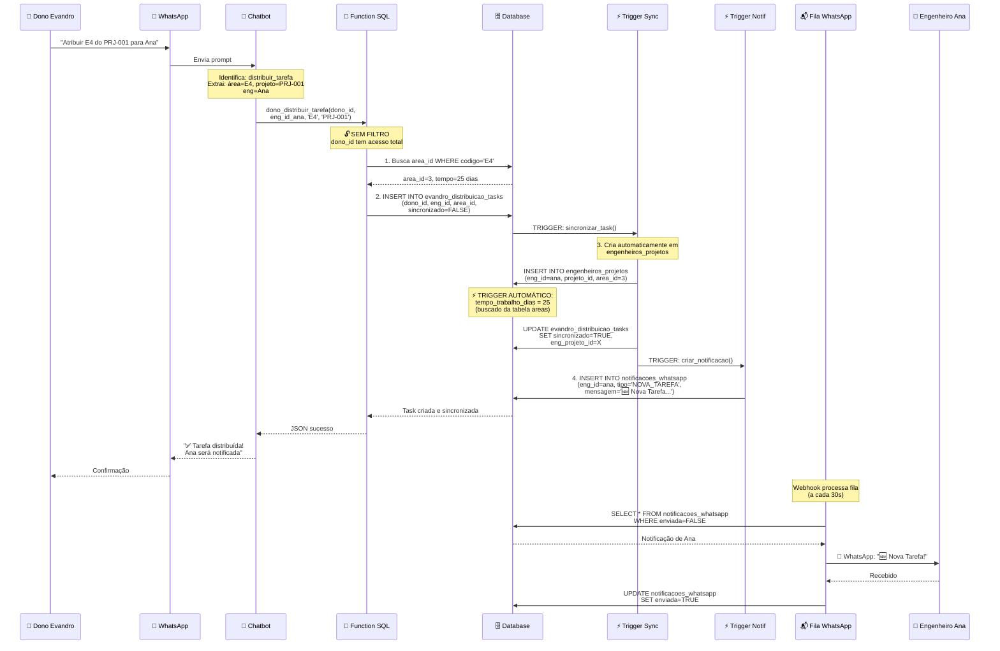

# 🎨 Diagrama Visual Completo do Sistema

## 📊 Visão Geral da Arquitetura

```
┌─────────────────────────────────────────────────────────────────────┐
│                        SISTEMA TECPRED                               │
│                    Gestão via Chatbot WhatsApp                       │
└─────────────────────────────────────────────────────────────────────┘

        ┌──────────────────┐                    ┌──────────────────┐
        │   ENGENHEIROS    │                    │  DONO (EVANDRO)  │
        │    (WhatsApp)    │                    │    (WhatsApp)    │
        │                  │                    │                  │
        │  🔒 Acesso:      │                    │  🔓 Acesso:      │
        │  Apenas seus     │                    │  TUDO            │
        │  projetos        │                    │                  │
        └────────┬─────────┘                    └────────┬─────────┘
                 │                                        │
                 │ Prompts naturais                      │ Comandos
                 │                                        │
                 └──────────────┬────────────────────────┘
                                │
                                ↓
                    ┌───────────────────────┐
                    │   CHATBOT (LLM)       │
                    │   Interpreta +        │
                    │   Extrai Parâmetros   │
                    └───────────┬───────────┘
                                │
                    ┌───────────┴───────────┐
                    │                       │
                    ↓                       ↓
        ┌──────────────────────┐   ┌──────────────────────┐
        │  FUNCTIONS            │   │  FUNCTIONS           │
        │  ENGENHEIROS          │   │  DONO                │
        │                       │   │                      │
        │  WHERE eng_id = ?     │   │  SEM WHERE           │
        │  (filtro automático)  │   │  (vê tudo)           │
        └──────────┬────────────┘   └──────────┬───────────┘
                   │                           │
                   └──────────┬────────────────┘
                              │
                              ↓
                ┌─────────────────────────────┐
                │   BANCO DE DADOS            │
                │   (PostgreSQL/Supabase)     │
                │                             │
                │   🔒 Row Level Security:    │
                │   - eng_id → Seus projetos  │
                │   - dono_id → Tudo          │
                └─────────────────────────────┘
```

---

## 🗄️ Diagrama de Entidades e Relacionamentos (ERD)



---

## 🔄 Fluxo de Dados: Engenheiro Registra Previsão



---

## 🔄 Fluxo de Dados: Dono Distribui Tarefa



---

## 🔐 Sistema de Controle de Acesso (RLS)

```
┌─────────────────────────────────────────────────────────────┐
│                    ROW LEVEL SECURITY                        │
│                  (Segurança por Linha)                       │
└─────────────────────────────────────────────────────────────┘

╔═══════════════════════════════════════════════════════════╗
║              ENGENHEIRO (eng_id)                           ║
║              🔒 Acesso Limitado                            ║
╚═══════════════════════════════════════════════════════════╝

SELECT * FROM engenheiros_projetos
WHERE eng_id = auth.uid()  ← 🔒 FILTRO AUTOMÁTICO
      ↓
┌─────────────────────────────────────────┐
│ Retorna APENAS projetos do engenheiro   │
│                                         │
│ ✅ eng_id = 'abc-123' (próprio)         │
│ ❌ eng_id = 'xyz-789' (outro)           │
└─────────────────────────────────────────┘

SELECT * FROM projetos_previsao
WHERE eng_id = auth.uid()  ← 🔒 FILTRO AUTOMÁTICO
      ↓
┌─────────────────────────────────────────┐
│ Retorna APENAS suas previsões           │
└─────────────────────────────────────────┘

SELECT * FROM retrabalho_projetos
WHERE eng_id = auth.uid()  ← 🔒 FILTRO AUTOMÁTICO
      ↓
┌─────────────────────────────────────────┐
│ Retorna APENAS seus retrabalhos         │
└─────────────────────────────────────────┘


╔═══════════════════════════════════════════════════════════╗
║              DONO (dono_id)                                ║
║              🔓 Acesso Total                               ║
╚═══════════════════════════════════════════════════════════╝

SELECT * FROM engenheiros_projetos
-- SEM WHERE! 🔓 Retorna TUDO
      ↓
┌─────────────────────────────────────────┐
│ Retorna TODOS os projetos               │
│                                         │
│ ✅ eng_id = 'abc-123' (Ana)             │
│ ✅ eng_id = 'xyz-789' (João)            │
│ ✅ eng_id = 'def-456' (Maria)           │
│ ✅ TODOS os engenheiros                 │
└─────────────────────────────────────────┘

SELECT * FROM vw_dono_visao_geral
-- Visão consolidada de TODOS
      ↓
┌─────────────────────────────────────────┐
│ Estatísticas de TODOS:                  │
│ - Total projetos: 25                    │
│ - Total áreas: 45                       │
│ - Retrabalhos: 8                        │
│ - Carga de trabalho de CADA um          │
└─────────────────────────────────────────┘
```

---

## ⚡ Triggers Automáticos e Fluxo de Dados

```
┌──────────────────────────────────────────────────────────────────┐
│                    TRIGGERS AUTOMÁTICOS                           │
│            (Executam automaticamente no banco)                    │
└──────────────────────────────────────────────────────────────────┘

╔═══════════════════════════════════════════════════════════════╗
║  1. TRIGGER: Calcular Tempo de Trabalho Automaticamente       ║
╚═══════════════════════════════════════════════════════════════╝

INSERT INTO engenheiros_projetos
(eng_id, projeto_id, area_id)
VALUES ('ana', 'prj-1', 3)  ← area_id = 3 (E4 - Elétrico Alliance)
      ↓
┌─────────────────────────────────────────┐
│ TRIGGER: trg_calcular_tempo_trabalho    │
│                                         │
│ SELECT tempo_trabalho_dias              │
│ FROM areas                              │
│ WHERE area_id = 3                       │
│                                         │
│ Resultado: 25 dias                      │
│                                         │
│ UPDATE NEW.tempo_trabalho_dias = 25     │
└─────────────────────────────────────────┘
      ↓
Resultado em engenheiros_projetos:
┌──────────┬────────────┬─────────┬────────────────────┐
│ eng_id   │ projeto_id │ area_id │ tempo_trabalho_dias │
├──────────┼────────────┼─────────┼────────────────────┤
│ ana      │ prj-1      │ 3       │ 25 ← AUTO!         │
└──────────┴────────────┴─────────┴────────────────────┘


╔═══════════════════════════════════════════════════════════════╗
║  2. TRIGGER: Calcular Percentual Automaticamente              ║
╚═══════════════════════════════════════════════════════════════╝

UPDATE engenheiros_projetos
SET status_id = 5  ← INSTALACOES_GROSSO
WHERE id = 'xyz'
      ↓
┌─────────────────────────────────────────┐
│ TRIGGER: trg_calcular_percentual_status │
│                                         │
│ SELECT percentual_base                  │
│ FROM status_codes                       │
│ WHERE status_id = 5                     │
│                                         │
│ Resultado: 35.00                        │
│                                         │
│ UPDATE NEW.percentual_andamento = 35.00 │
└─────────────────────────────────────────┘
      ↓
Resultado em engenheiros_projetos:
┌────┬───────────┬───────────────────────┐
│ id │ status_id │ percentual_andamento  │
├────┼───────────┼───────────────────────┤
│xyz │ 5         │ 35.00 ← AUTO!         │
└────┴───────────┴───────────────────────┘


╔═══════════════════════════════════════════════════════════════╗
║  3. TRIGGER: Preencher Variáveis Compartilhadas               ║
╚═══════════════════════════════════════════════════════════════╝

INSERT INTO projetos_previsao
(eng_projeto_id, previsao_texto)
VALUES ('abc', 'Realizar traçado')
      ↓
┌─────────────────────────────────────────┐
│ TRIGGER: trg_preencher_vars_previsao    │
│                                         │
│ SELECT projeto_id, eng_id               │
│ FROM engenheiros_projetos               │
│ WHERE id = 'abc'                        │
│                                         │
│ Resultado: projeto_id='prj-1',          │
│            eng_id='ana'                 │
│                                         │
│ UPDATE NEW.projeto_id = 'prj-1'         │
│ UPDATE NEW.eng_id = 'ana'               │
└─────────────────────────────────────────┘
      ↓
Resultado em projetos_previsao:
┌─────────────────┬────────────┬────────┬───────────────────┐
│ eng_projeto_id  │ projeto_id │ eng_id │ previsao_texto    │
├─────────────────┼────────────┼────────┼───────────────────┤
│ abc             │ prj-1 AUTO │ana AUTO│ Realizar traçado  │
└─────────────────┴────────────┴────────┴───────────────────┘


╔═══════════════════════════════════════════════════════════════╗
║  4. TRIGGER: Tornar Previsão Imutável Após Fim do Dia         ║
╚═══════════════════════════════════════════════════════════════╝

UPDATE projetos_previsao
SET feito_texto = 'Terminei 80% do traçado'
WHERE id = 'xyz' AND editavel = TRUE
      ↓
┌─────────────────────────────────────────┐
│ TRIGGER: trg_validar_edicao_previsao    │
│                                         │
│ IF NEW.feito_texto IS NOT NULL THEN     │
│   NEW.editavel = FALSE                  │
│   NEW.data_fim_dia = NOW()              │
│ END IF                                  │
└─────────────────────────────────────────┘
      ↓
Resultado em projetos_previsao:
┌────┬──────────────┬───────────────────────┬──────────┐
│ id │ feito_texto  │ editavel              │data_fim  │
├────┼──────────────┼───────────────────────┼──────────┤
│xyz │ Terminei 80% │ FALSE ← IMUTÁVEL!     │ NOW()    │
└────┴──────────────┴───────────────────────┴──────────┘

🔒 Tentativa de editar novamente:
UPDATE projetos_previsao SET feito_texto = 'Outro'
WHERE id = 'xyz'
      ↓
❌ ERRO: "Registro não pode ser editado após o fim do dia"


╔═══════════════════════════════════════════════════════════════╗
║  5. TRIGGER: Validar Motivo Obrigatório em Retrabalhos        ║
╚═══════════════════════════════════════════════════════════════╝

INSERT INTO retrabalho_projetos
(eng_projeto_id, necessitou_retrabalho, motivo_retrabalho)
VALUES ('abc', TRUE, NULL)  ← Motivo vazio!
      ↓
┌─────────────────────────────────────────┐
│ TRIGGER: trg_validar_motivo_retrabalho  │
│                                         │
│ IF NEW.necessitou_retrabalho = TRUE AND │
│    NEW.motivo_retrabalho IS NULL THEN   │
│   RAISE EXCEPTION 'Motivo obrigatório!' │
│ END IF                                  │
└─────────────────────────────────────────┘
      ↓
❌ ERRO: "Motivo do retrabalho é obrigatório quando necessitou_retrabalho = TRUE"

✅ Correto:
INSERT INTO retrabalho_projetos
(eng_projeto_id, necessitou_retrabalho, motivo_retrabalho)
VALUES ('abc', TRUE, 'Cliente mudou projeto')  ← Com motivo!
      ↓
✅ Inserido com sucesso


╔═══════════════════════════════════════════════════════════════╗
║  6. TRIGGER: Sincronizar Task Dono → Engenheiro               ║
╚═══════════════════════════════════════════════════════════════╝

INSERT INTO evandro_distribuicao_tasks
(dono_id, eng_id, projeto_id, area_id, sincronizado=FALSE)
VALUES ('evandro', 'ana', 'prj-1', 3, FALSE)
      ↓
┌─────────────────────────────────────────────────────────┐
│ TRIGGER: trg_sincronizar_task                            │
│                                                         │
│ 1. IF NEW.sincronizado = FALSE THEN                     │
│                                                         │
│ 2. INSERT INTO engenheiros_projetos                     │
│    (eng_id, projeto_id, area_id, ...)                   │
│    VALUES (NEW.eng_id, NEW.projeto_id, NEW.area_id, ...)│
│                                                         │
│ 3. UPDATE evandro_distribuicao_tasks                    │
│    SET sincronizado = TRUE,                             │
│        eng_projeto_id = <id_criado>                     │
│                                                         │
│ 4. INSERT INTO notificacoes_whatsapp                    │
│    (eng_id, mensagem, ...)                              │
│    VALUES (NEW.eng_id, '🆕 Nova Tarefa...', ...)        │
│                                                         │
│ END IF                                                  │
└─────────────────────────────────────────────────────────┘
      ↓
Resultado em evandro_distribuicao_tasks:
┌─────────┬────────┬────────────┬─────────────┬───────────────────┐
│ dono_id │ eng_id │ projeto_id │ sincronizado│ eng_projeto_id    │
├─────────┼────────┼────────────┼─────────────┼───────────────────┤
│evandro  │ ana    │ prj-1      │ TRUE ← AUTO │ xyz-123 ← AUTO    │
└─────────┴────────┴────────────┴─────────────┴───────────────────┘

Resultado em engenheiros_projetos (CRIADO AUTO):
┌────────┬────────────┬─────────┬────────────────────┐
│ eng_id │ projeto_id │ area_id │ tempo_trabalho_dias │
├────────┼────────────┼─────────┼────────────────────┤
│ ana    │ prj-1      │ 3       │ 25 ← AUTO!         │
└────────┴────────────┴─────────┴────────────────────┘

Resultado em notificacoes_whatsapp (CRIADO AUTO):
┌────────┬────────────────────────────┬─────────┐
│ eng_id │ mensagem                   │ enviada │
├────────┼────────────────────────────┼─────────┤
│ ana    │ 🆕 Nova Tarefa Atribuída! │ FALSE   │
└────────┴────────────────────────────┴─────────┘
```

---

## 📊 Exemplo Completo de Fluxo: Do Chatbot ao Banco

```
┌────────────────────────────────────────────────────────────────┐
│  EXEMPLO: Engenheiro Ana Registra Previsão do Dia             │
└────────────────────────────────────────────────────────────────┘

1️⃣ CHATBOT WHATSAPP
   ↓
👤 Ana: "Previsão de hoje PRJ-001"
   ↓
   
2️⃣ CHATBOT (LLM)
   ↓
🤖 Interpreta:
   - Ação: registrar_previsao
   - Projeto: PRJ-001
   - eng_id: ana (do auth)
   ↓
   
3️⃣ FUNCTION SQL
   ↓
📞 Chama: registrar_previsao_dia_com_sugestoes(
      p_eng_id := 'ana',
      p_atribuicao_id := <busca de PRJ-001>,
      p_previsao_texto := NULL  ← Pedir sugestões
   )
   ↓
   
4️⃣ BANCO DE DADOS (Query 1)
   ↓
SELECT status_id 
FROM engenheiros_projetos 
WHERE eng_id = 'ana'  ← 🔒 Filtro automático
  AND projeto_id = (SELECT projeto_id FROM projetos 
                    WHERE codigo_projeto = 'PRJ-001')

Resultado: status_id = 2 (EM_EXECUCAO)
   ↓
   
5️⃣ BANCO DE DADOS (Query 2)
   ↓
SELECT descricao
FROM status_detalhamento
WHERE status_codigo = 'EM_EXECUCAO'
  AND tipo = 'PREVISAO'
ORDER BY ordem

Resultado: 16 sugestões
   ↓
   
6️⃣ RETORNO AO CHATBOT
   ↓
🤖 Formata resposta:
   "📋 Sugestões de previsão:
    1️⃣ Solicitar planta baixa
    2️⃣ Checar compatibilização
    3️⃣ Preparar checklist
    ...
    6️⃣ Realizar traçado preliminar
    ..."
   ↓
   
7️⃣ USUÁRIO ESCOLHE
   ↓
👤 Ana: "6"
   ↓
   
8️⃣ CHATBOT PROCESSA
   ↓
🤖 Extrai: sugestão #6 = "Realizar traçado preliminar"
   ↓
   
9️⃣ FUNCTION SQL (INSERT)
   ↓
📞 Chama: registrar_previsao_dia_com_sugestoes(
      p_eng_id := 'ana',
      p_atribuicao_id := 'abc-123',
      p_previsao_texto := 'Realizar traçado preliminar'
   )
   ↓
   
🔟 BANCO DE DADOS (Insert)
   ↓
INSERT INTO projetos_previsao (
  eng_projeto_id,
  previsao_texto,
  data_registro
) VALUES (
  'abc-123',
  'Realizar traçado preliminar',
  CURRENT_DATE
)
   ↓
   
1️⃣1️⃣ TRIGGER AUTOMÁTICO
   ↓
⚡ TRIGGER: trg_preencher_vars_previsao
   - Busca projeto_id automaticamente
   - Busca eng_id automaticamente
   - Preenche campos compartilhados
   ↓
   
1️⃣2️⃣ RESULTADO FINAL
   ↓
Tabela projetos_previsao:
┌─────────────────┬────────────┬────────┬──────────────────────────┬────────────┬──────────┐
│ eng_projeto_id  │ projeto_id │ eng_id │ previsao_texto           │ data       │ editavel │
├─────────────────┼────────────┼────────┼──────────────────────────┼────────────┼──────────┤
│ abc-123         │ prj-1 AUTO │ana AUTO│ Realizar traçado prelim. │ 2025-12-19 │ TRUE     │
└─────────────────┴────────────┴────────┴──────────────────────────┴────────────┴──────────┘
   ↓
   
1️⃣3️⃣ RETORNO AO CHATBOT
   ↓
🤖 "✅ Previsão registrada com sucesso!
    📝 'Realizar traçado preliminar'
    📅 19/12/2025"
   ↓
   
1️⃣4️⃣ USUÁRIO RECEBE
   ↓
📱 Ana vê confirmação no WhatsApp
```

---

## 🎯 Visualização das Permissões

```
┌──────────────────────────────────────────────────────────────┐
│              MATRIZ DE PERMISSÕES                             │
└──────────────────────────────────────────────────────────────┘

╔══════════════════════════════════════════════════════════════╗
║                     ENGENHEIRO (eng_id)                       ║
╚══════════════════════════════════════════════════════════════╝

Tabela: engenheiros
  ✅ SELECT: Apenas SEU registro (WHERE eng_id = auth.uid())
  ✅ UPDATE: Apenas SEU nome e exclusividade
  ❌ DELETE: Não pode deletar
  ❌ INSERT: Não (cadastro via dono ou admin)

Tabela: projetos
  ✅ SELECT: Todos (leitura de códigos e clientes)
  ❌ INSERT: Não (criado pelo dono ou via system)
  ❌ UPDATE: Não
  ❌ DELETE: Não

Tabela: areas
  ✅ SELECT: Todas (para escolher área)
  ❌ INSERT/UPDATE/DELETE: Não (master data)

Tabela: status_codes
  ✅ SELECT: Todos (para visualizar)
  ❌ INSERT/UPDATE/DELETE: Não (master data)

Tabela: engenheiros_projetos
  ✅ SELECT: Apenas SEUS projetos (WHERE eng_id = auth.uid())
  ✅ UPDATE: Apenas data_prevista, status_id, observacoes
  ❌ DELETE: Não (somente inativar)
  ❌ INSERT: Não (criado pelo dono via distribuição)

Tabela: projetos_previsao
  ✅ SELECT: Apenas SUAS previsões (WHERE eng_id = auth.uid())
  ✅ INSERT: Pode criar previsão do dia
  ✅ UPDATE: Apenas se editavel = TRUE
  ❌ DELETE: Não (histórico imutável)

Tabela: retrabalho_projetos
  ✅ SELECT: Apenas SEUS retrabalhos (WHERE eng_id = auth.uid())
  ✅ INSERT: Pode registrar retrabalho
  ❌ UPDATE: Não (histórico imutável)
  ❌ DELETE: Não

Tabela: prazos
  ✅ SELECT: Apenas SEUS prazos (WHERE eng_id = auth.uid())
  ✅ INSERT/UPDATE: Pode gerenciar seus prazos
  ❌ DELETE: Não

Tabela: evandro_distribuicao_tasks
  ✅ SELECT: Apenas tasks PARA ELE (WHERE eng_id = auth.uid())
  ✅ UPDATE: Apenas status_task (ACEITA/RECUSADA)
  ❌ DELETE: Não
  ❌ INSERT: Não (somente o dono distribui)

Tabela: notificacoes_whatsapp
  ✅ SELECT: Apenas SUAS notificações (WHERE eng_id = auth.uid())
  ❌ UPDATE/DELETE/INSERT: Não (gerenciado pelo sistema)


╔══════════════════════════════════════════════════════════════╗
║                     DONO (dono_id)                            ║
╚══════════════════════════════════════════════════════════════╝

Todas as Tabelas:
  ✅ SELECT: TUDO (sem filtros)
  ✅ INSERT: Pode criar qualquer registro
  ✅ UPDATE: Pode atualizar qualquer registro
  ✅ DELETE: Pode deletar (com cuidado)

Views Especiais:
  ✅ vw_dono_visao_geral: Ver TODOS os engenheiros
  ✅ vw_dono_engenheiro_detalhado: Ver detalhes de QUALQUER um
  ✅ vw_dono_retrabalhos_historico: Ver TODOS os retrabalhos
  ✅ vw_dono_taxa_execucao_ranking: Ranking de TODOS

Functions Especiais:
  ✅ dono_distribuir_tarefa(): Distribuir para qualquer engenheiro
  ✅ dono_consultar_todos_engenheiros(): Ver status de todos
  ✅ dono_buscar_historico_retrabalhos(): Ver todos os retrabalhos
  ✅ dono_recomendar_engenheiro(): Recomendação inteligente
```

---

## 🔄 Contador de Retrabalhos (Via VIEW)

```
┌──────────────────────────────────────────────────────────────┐
│           CONTADOR AUTOMÁTICO DE RETRABALHOS                  │
│                  (Sem variável separada!)                     │
└──────────────────────────────────────────────────────────────┘

INSERT INTO retrabalho_projetos
VALUES ('abc', TRUE, 'Cliente mudou', ...)  ← Retrabalho #1
      ↓
INSERT INTO retrabalho_projetos
VALUES ('abc', TRUE, 'Erro no projeto', ...)  ← Retrabalho #2
      ↓
INSERT INTO retrabalho_projetos
VALUES ('abc', TRUE, 'Documentação errada', ...)  ← Retrabalho #3
      ↓

Tabela retrabalho_projetos:
┌─────────────────┬───────────────────────┬──────────────────────┐
│ eng_projeto_id  │ necessitou_retrabalho │ motivo_retrabalho    │
├─────────────────┼───────────────────────┼──────────────────────┤
│ abc             │ TRUE                  │ Cliente mudou        │
│ abc             │ TRUE                  │ Erro no projeto      │
│ abc             │ TRUE                  │ Documentação errada  │
└─────────────────┴───────────────────────┴──────────────────────┘

VIEW: vw_quantidade_retrabalhos
      ↓
SELECT 
  eng_projeto_id,
  COUNT(*) FILTER (WHERE necessitou_retrabalho = TRUE) 
    AS quantidade_retrabalhos
FROM retrabalho_projetos
GROUP BY eng_projeto_id

Resultado:
┌─────────────────┬────────────────────────┐
│ eng_projeto_id  │ quantidade_retrabalhos │
├─────────────────┼────────────────────────┤
│ abc             │ 3 ← CONTADOR AUTO!     │
└─────────────────┴────────────────────────┘

🎯 Chatbot consulta:
SELECT quantidade_retrabalhos
FROM vw_quantidade_retrabalhos
WHERE eng_projeto_id = 'abc'

Retorna: 3 ✅ (calculado automaticamente via COUNT!)
```

---

## 📋 Resumo Visual

```
┌────────────────────────────────────────────────────────────────┐
│                    RESUMO DO SISTEMA                            │
└────────────────────────────────────────────────────────────────┘

🏗️ ESTRUTURA
├─ 13 Tabelas
├─ 22 Áreas (H1-H6, E1-E4, T1-T4, G1-G4, CL1-CL4)
├─ 7 Status (Aguardando → Concluído)
└─ 77 Sugestões de atividades

⚡ AUTOMAÇÕES
├─ 9 Triggers (tempo, %, variáveis, validações)
├─ Contador de retrabalhos (via COUNT)
├─ Sincronização dono → engenheiro
└─ Notificações WhatsApp automáticas

🔐 SEGURANÇA
├─ Engenheiro: WHERE eng_id = auth.uid() 🔒
├─ Dono: SEM WHERE (acesso total) 🔓
├─ Previsões imutáveis após fim do dia
└─ Motivo obrigatório em retrabalhos

🤖 CHATBOT
├─ Sugestões inteligentes por status
├─ Autocomplete de atividades
├─ Validações em tempo real
└─ Feedback instantâneo

📊 VIEWS
├─ 12 Views consolidadas
├─ Estatísticas por engenheiro
├─ Ranking de desempenho
└─ Histórico para gráficos
```

---

**🎨 Diagrama completo do sistema pronto!**

