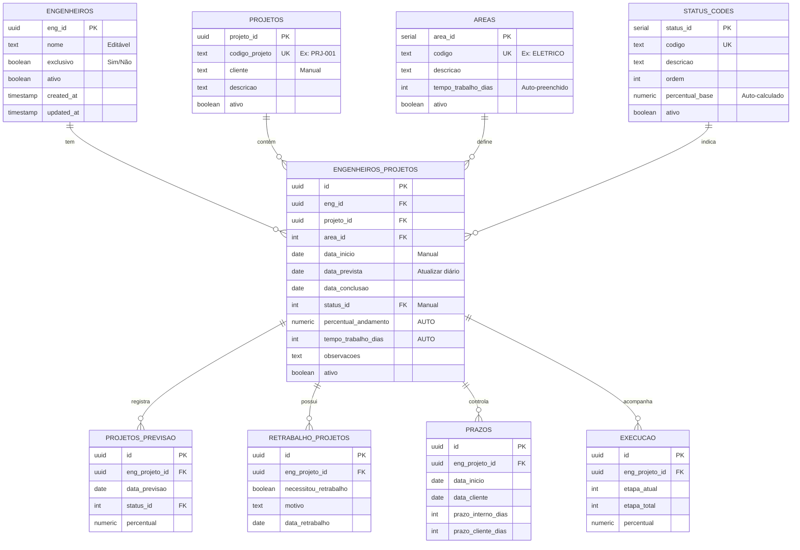

# 📊 Diagrama do Banco de Dados

## Relacionamentos



## Fluxo de Dados

### 1. Cadastro e Atribuição

```
┌─────────────┐
│ Engenheiro  │
│ cadastrado  │
└──────┬──────┘
       │
       ├─> Edita nome
       ├─> Define exclusividade (Sim/Não)
       │
       v
┌─────────────────┐
│ Projeto criado  │
│ (código manual) │
└────────┬────────┘
         │
         v
┌──────────────────────────┐
│ Atribuição:              │
│ Eng + Projeto + Área     │
│                          │
│ Manual:                  │
│ - data_inicio            │
│ - data_prevista          │
│ - status_id              │
│                          │
│ Automático:              │
│ - tempo_trabalho_dias ← areas.tempo_trabalho_dias    │
│ - percentual_andamento ← status_codes.percentual_base│
└──────────────────────────┘
```

### 2. Múltiplas Áreas no Mesmo Projeto

```
Engenheiro: João Silva
Projeto: PRJ-2025-001

┌─────────────────────────┐
│ Atribuição 1:           │
│ Área: Elétrico          │
│ Tempo: 15 dias (AUTO)   │
│ Status: Em execução     │
│ %: 35% (AUTO)           │
└─────────────────────────┘

┌─────────────────────────┐
│ Atribuição 2:           │
│ Área: Hidráulico        │
│ Tempo: 12 dias (AUTO)   │
│ Status: Em planejamento │
│ %: 5% (AUTO)            │
└─────────────────────────┘

Total: 27 dias de trabalho
Registros: 2 linhas na tabela engenheiros_projetos
```

### 3. Atualização de Status

```
Engenheiro atualiza status:
status_id = 5 (Instalações Primeira Fase)
           ↓
    [TRIGGER AUTOMÁTICO]
           ↓
percentual_andamento = 35.00
           ↓
Salvo no banco de dados
```

## Exemplo Prático Completo

### Cenário:
**Engenheiro:** Ana Santos  
**Projeto:** Edifício Residencial XYZ  
**Áreas responsáveis:** Elétrico + Climatização

### Passo 1: Cadastrar Engenheiro
```sql
INSERT INTO engenheiros (nome, exclusivo) 
VALUES ('Ana Santos', true);
-- Retorna: eng_id = 'abc-123'
```

### Passo 2: Cadastrar Projeto
```sql
INSERT INTO projetos (codigo_projeto, cliente) 
VALUES ('PRJ-2025-001', 'Construtora ABC');
-- Retorna: projeto_id = 'xyz-789'
```

### Passo 3: Atribuir Área Elétrico
```sql
INSERT INTO engenheiros_projetos (
    eng_id, projeto_id, area_id, 
    data_inicio, data_prevista, status_id
) VALUES (
    'abc-123',
    'xyz-789',
    1, -- Elétrico
    '2025-01-15',
    '2025-02-15',
    4 -- Serviços Preliminares
);

-- RESULTADO AUTOMÁTICO:
-- tempo_trabalho_dias = 15
-- percentual_andamento = 20.00
```

### Passo 4: Atribuir Área Climatização
```sql
INSERT INTO engenheiros_projetos (
    eng_id, projeto_id, area_id,
    data_inicio, data_prevista, status_id
) VALUES (
    'abc-123',
    'xyz-789',
    4, -- Climatização
    '2025-02-01',
    '2025-02-28',
    2 -- Em Planejamento
);

-- RESULTADO AUTOMÁTICO:
-- tempo_trabalho_dias = 10
-- percentual_andamento = 5.00
```

### Resultado Final:
```
Ana Santos trabalha no PRJ-2025-001 com:
├─ Elétrico (15 dias, 20% concluído)
└─ Climatização (10 dias, 5% concluído)
Total: 25 dias de trabalho estimado
```

## Consultas Visuais

### Ver Planilha do Engenheiro
```sql
SELECT 
    codigo_projeto,
    area_descricao,
    data_inicio,
    data_prevista,
    status_descricao,
    percentual_andamento,
    tempo_trabalho_dias
FROM vw_engenheiros_projetos
WHERE engenheiro_nome = 'Ana Santos'
ORDER BY data_inicio;
```

**Resultado:**
| Projeto | Área | Data Início | Previsão | Status | % | Dias |
|---------|------|-------------|----------|--------|---|------|
| PRJ-2025-001 | Elétrico | 15/01/2025 | 15/02/2025 | Serviços Preliminares | 20% | 15 |
| PRJ-2025-001 | Climatização | 01/02/2025 | 28/02/2025 | Em Planejamento | 5% | 10 |

---

## 🎯 Características-Chave

✅ **Um engenheiro pode ter múltiplas áreas no mesmo projeto**  
✅ **Tempo de trabalho calculado automaticamente da tabela de áreas**  
✅ **Percentual calculado automaticamente da tabela de status**  
✅ **Cada atribuição (eng + projeto + área) é única**  
✅ **Engenheiro atualiza apenas: data_inicio, data_prevista, status**  
✅ **Sistema calcula: tempo_trabalho, percentual_andamento**

